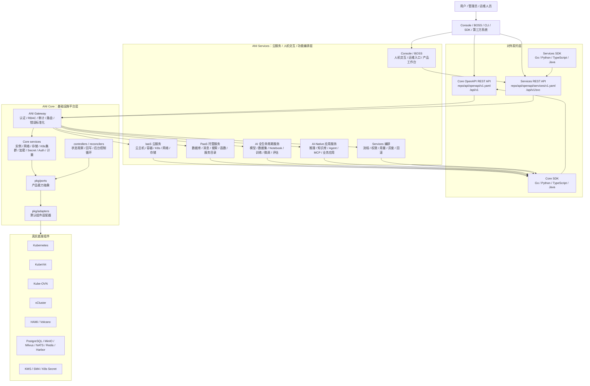
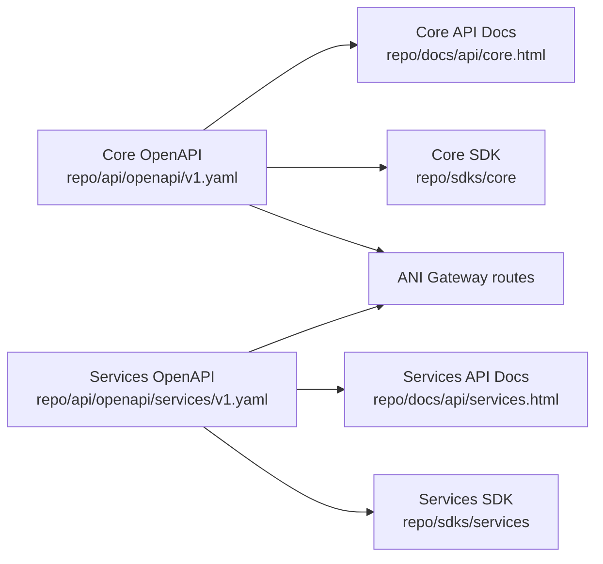
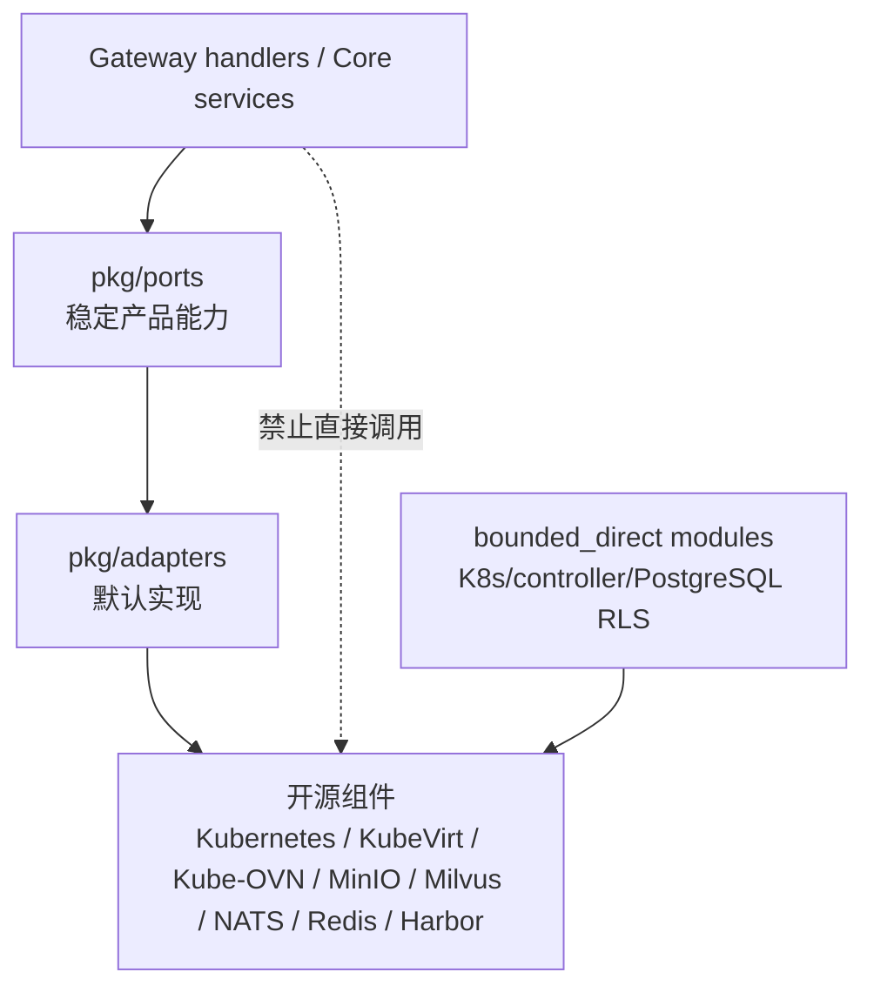
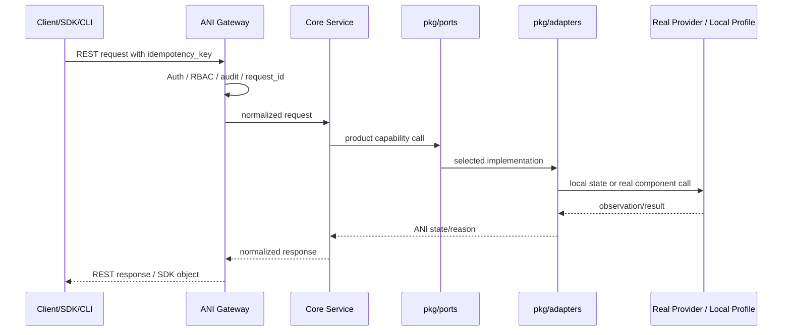
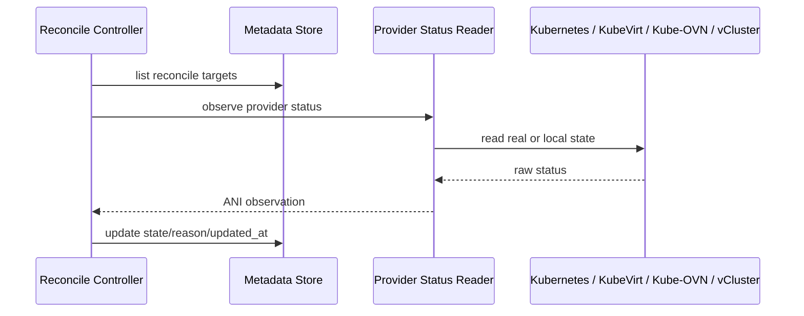

# KuberCloud ANI · 系统架构设计

> 版本 V8.4 | 广州常青云科技有限公司 | 内部产品规划文件
> 最后更新：2026-05-23（重写架构图与 Core/Services 边界）

> 本文定义系统架构和模块边界，不作为当前开发任务清单。当前开发阶段、已完成项、未完成项和验收命令以 `repo/CURRENT-SPRINT.md`、`ANI-06-开发计划.md` Section 零和 `repo/development-records/README.md` 为准。

---

## 一、本文解决什么问题

ANI 文档必须同时服务两类读者：

- **人类读者**：能快速判断产品分层、责任边界、当前建设重点和哪些能力尚未生产就绪。
- **AI 开发工具**：能按固定入口读取事实来源，避免把历史规划、样例或过期图当成当前代码事实。

本文只回答架构问题：

1. ANI Core 和 ANI Services 如何分层。
2. 外部 API、SDK、CLI、Console 如何消费能力。
3. Core 如何通过 ports/adapters 对接开源组件。
4. 当前 local profile、contract、real provider 的成熟度边界。

不在本文维护每日开发进度、批次流水账或提交状态。

---

## 二、当前架构结论

```text
ANI = ANI Core + ANI Services

ANI Core:
  基础设施控制平面，只提供基础设施能力。
  跨层控制面契约输出 Core OpenAPI REST API、Core SDK、CLI。
  不实现模型推理、RAG、知识库问答或 PaaS 业务逻辑。

ANI Services:
  云服务、人机交互展现和功能编排层，通过 Core OpenAPI REST API / Core SDK 组合基础设施能力。
  最终实现 ANI 定义的各种功能：IaaS、PaaS、AI 全生命周期服务、AI-Native 应用、
  Console/BOSS、Agent、MCP、业务应用、运维治理与功能编排。

底层开源组件:
  以原生 Kubernetes 为底座，慎重选择 KubeVirt / Kube-OVN / vCluster / MinIO / Milvus /
  NATS / Redis / Harbor 等开源组件，经 adapter/controller/provider 封装和编排后形成云服务能力。
  Kubernetes 版本、API、RuntimeClass、CSI、CNI、CRD 语义必须与开源社区同步，不能绑定特定 Kubernetes 发行版。
  默认组件必须经过准入评估：GitHub 社区热度、稳定 release、源码和文档质量、运维运营能力、
  离线部署能力、License 与可替换退出路径都要清楚。
```

当前代码状态已经体现这一分层：

| 层 | 当前事实 |
|---|---|
| Core API | `repo/api/openapi/v1.yaml` |
| Services API | `repo/api/openapi/services/v1.yaml` |
| Core SDK | `repo/sdks/core/` |
| Services SDK | `repo/sdks/services/` |
| Gateway | `repo/services/ani-gateway/`，统一承载 HTTP 入口和契约路由 |
| Core 能力抽象 | `repo/pkg/ports/` |
| Core 默认适配器 | `repo/pkg/adapters/` |
| Services 暂存实现 | `repo/services/model-service/`、`repo/services/kb-service/`、`repo/ai/`、`repo/operators/inference-operator/`、`repo/frontends/console/` 中存在历史/临时 Services 逻辑；这些代码不定义最终 Services 边界，不允许被 Core 调用 |

> **Services 受控解冻门禁（原 Services 重定义门禁）：** 由于项目初期 Core/Services 边界尚未完全想清楚，Repo 中保留了一些早期 Services 逻辑。2026-06-15 至 2026-06-20 的前端功能、Services 功能和接口定义输出仍作为历史背景；当前不再按旧冻结规则处理 Services，也不要求 Core 基于猜测删除/覆盖旧逻辑。后续 Services 代码必须 API-first，以 Services 自有定义和 Core OpenAPI/SDK 为准，并通过 CODEOWNERS 共同审查、API split、Services boundary gate 与现有 architecture gate。

当前 Services ownership matrix：

| 范围 | 主责 | 当前门禁 |
|---|---|---|
| `repo/services/model-service/`、`repo/services/kb-service/`、`repo/ai/`、`repo/frontends/` | Services 主责，Core 关注跨层边界 | CODEOWNERS 共同审查；禁止新增 Core internal import；Services boundary gate |
| `repo/api/openapi/services/v1.yaml`、`repo/sdks/services/`、`repo/docs/api/services.html` | Services 主责，Core 共同 review | API split；生成物必须来自 Services OpenAPI |
| `repo/services/ani-gateway/` 混合 Gateway handler | `/api/v1/svc/*` Services handler 由 Services 主责、Core 共同 review；Core `/api/v1/*` handler 和 middleware/runtime 由 Core 主责 | handler 路由分区、API split、architecture gate |
| `repo/pkg/`、`repo/api/openapi/v1.yaml`、`repo/deploy/`、`repo/scripts/`、`repo/sdks/core/`、`repo/cli/` | Core 保护目录 | Services PR 触碰时必须 Core review，不得自行合并 |

解冻后的门禁顺序：先改 `repo/api/openapi/services/v1.yaml` 或 Core API 契约并完成共同审查 → 再改 Services handler/实现 → 再生成 SDK/前端类型 → 运行 `make validate-services`。该聚合门禁包含 API split、Services boundary、OpenAPI/Gateway route contract、Services semantic contract、SDK/API docs 生成漂移、模块检查、`make validate-architecture` 与文档入口 gate。已登记的存量例外只代表当前代码事实告警，不代表边界合规或 production-ready。

---

## 三、总架构图



读图要点：

- Core API 和 Services API 是两套契约，路径、SDK、职责都分开。
- Services 可以使用 Core SDK，但 Core 不允许 import 或调用 Services 代码。
- Gateway 可以承载路由入口，但不能把 Services 业务资源写回 Core API。
- Kubernetes 原生能力只能在 adapter/controller/preflight 等 bounded module 内使用。

---

## 四、Core 与 Services 的职责边界

### 4.1 ANI Core 负责什么

ANI Core 负责基础设施平台能力，当前 P0/P1 主要包括：

| 能力域 | Core 责任 |
|---|---|
| 计算 | VM、Container、GPU Container、Sandbox、Batch Job、K8s Cluster 等实例和运行时抽象 |
| 网络 | VPC、Subnet、安全组、负载入口、Kube-OVN provider 边界 |
| 存储 | block/file/object/vector store 的资源 API、状态和 provider 边界 |
| 身份安全 | Auth、RBAC、OIDC/API Key、Workload Identity、加密、Secret 元数据和绑定意图 |
| 控制循环 | reconcile、provider status observation、状态回写 |
| SDK/CLI | 从 Core OpenAPI 生成并维护 Core SDK/CLI |

Core 不负责：

- 模型训练、推理、微调、RAG。
- 知识库问答、Agent、MCP 业务编排。
- PaaS 业务资源的对外语义。
- 直接向客户承诺某个开源组件名称就是产品能力。

### 4.2 ANI Services 负责什么

ANI Services 是 Core 之上的云服务、人机交互展现和功能编排层。Core 的存在目的之一，就是把基础设施能力以稳定的 Core OpenAPI REST API、Core SDK 和 CLI 交给 Services 调用；Services 才是面向用户实现 ANI 功能的产品层。这里的 REST/SDK 不是只给网页前端使用，Go 后端 Services、CLI、自动化脚本和第三方系统也应通过同一套控制面契约调用 Core。

Core/Services 的跨层控制面契约是 OpenAPI REST + Core SDK。gRPC 是 Core 内部高效通信机制，可用于 Gateway 到 Core 内部 service、Core service 之间或被 SDK transport adapter 隐藏；但它不能成为 Services 绕过 Core OpenAPI 的第二套产品接口，也不能和 OpenAPI 维护两套互相冲突的资源语义。

当前 `repo/api/openapi/services/v1.yaml` 只覆盖 Services 的首批 API 切片：`models`、`inference-services`、`knowledge-bases`。这不是 ANI Services 的完整范围；完整范围必须在 2026-06-15 至 2026-06-20 由 ANI Services 团队输出前端功能、Services 功能和接口定义后确认。

| 能力域 | Services 责任 |
|---|---|
| 模型仓库 | 模型元数据、版本、导入、发布策略；需要对象存储和加密时调用 Core |
| 推理服务 | 推理部署、OpenAI 兼容入口、流式输出、灰度和回滚策略 |
| 知识库 | 文档解析、向量化、检索、RAG、问答链路 |
| PaaS 托管服务 | 托管数据库、托管消息、托管搜索、函数计算、服务目录等；通过 Core 能力编排，不直接泄漏底层组件 |
| AI 应用 | Agent、MCP、行业应用、工作流 |
| 前端与编排 | Console/BOSS、人机交互、功能编排、流程闭环、灰度/回滚、用量展示 |
| 业务 mock | Services 团队自行建设，不能放入 Core dev profile |

Services 的硬规则：

```text
Services 只能通过 Core OpenAPI REST API / Core SDK 使用 Core 能力。
Services 禁止 import Core 内部包；已登记存量例外必须由 Services boundary gate 告警并逐步迁移，新增导入不得扩散。
Services 禁止直接调用 Core 内部 gRPC service。
Services 禁止新增直接调用底层 K8s、MinIO、Milvus、Redis、NATS、Harbor 等组件 SDK；已登记 provider SDK 例外不代表 production-ready。
```

现有 Repo 中的 Services 相关目录如果与评审后的功能/接口定义不一致，应以 API-first 的 PR 迁移；不要把早期 `model-service`、空 `kb-service`、前端单 API Client 或推理 operator 骨架当成最终架构事实，也不要把受控解冻理解为生产就绪结论。

---

## 五、API 与 SDK 架构



规则：

1. Core OpenAPI REST API 与 Core/Services 跨层控制面契约的唯一真实来源是 `repo/api/openapi/v1.yaml`。
2. Services API 唯一真实来源是 `repo/api/openapi/services/v1.yaml`。
3. 新增或修改 REST 能力必须先改 OpenAPI，再写实现、测试、SDK 和文档。
4. Core SDK 不得包含 Services 业务资源；Services SDK 不得反向包含 Core 内部实现。
5. Proto 是 Core 内部 gRPC 实现细节；当 Proto 与 OpenAPI 描述同一资源冲突时，以 OpenAPI 为准。

当前固定校验入口：

```bash
make validate-doc-api
make validate-sdk-beta
make validate-sdk-mock-smoke
make validate-sprint4-closure
```

---

## 六、ports/adapters 架构



`port` 在本项目中指“产品能力抽象/接口边界”，不是 TCP/IP 端口。

必须经过 ports/adapters 的情况：

- 该能力会被 Core service、Gateway handler、Services 或 SDK 调用。
- 该能力存在合理替换、多实现或云厂商差异。
- 需要统一租户隔离、幂等、审计、错误语义、状态机或 reconcile。

不强制新增 port 的情况：

- 标准库、日志、JSON/YAML、测试工具。
- HTTP router、gRPC server bootstrap 等框架 glue code。
- Kubernetes/client-go/controller-runtime/CRD 等平台控制面原生 API，但只能在 adapter/controller/preflight 等 bounded module 内使用。
- PostgreSQL/RLS 等安全与事务基线能力，若已登记为 bounded persistence module，可在限定模块内直接使用。

详细规则以 `ANI-13-开源组件松耦合适配器架构.md` 为准。

---

## 七、真实 provider 与 local profile 的成熟度边界

从 Sprint 5 起，必须明确每个能力处于哪个成熟度：

| 成熟度 | 含义 | 可以声称 | 不能声称 |
|---|---|---|---|
| contract | API 契约、schema、SDK 或文档已定义 | 接口语义已定义 | 代码已运行 |
| local-profile | 本地 adapter、路由、状态机、单元测试已完成 | 可用于开发联调和 Services 提前开发 | 真实组件已跑通 |
| real-provider | 已接入真实底座组件，并有固定命令或记录验证 | 可进入真实主链路联调 | 生产就绪 |
| production-ready | 具备 HA、指标、告警、重试、灰度、审计、容量验证 | 可交付生产 | 无限制可扩展 |

当前 Sprint 5 的真实底座门禁入口是：

```bash
make validate-real-k8s-profile
```

该命令默认验证真实环境门禁定义和文档闭环。三台云 VM 的 K8s 环境、Kube-OVN、KubeVirt、vCluster 等准备好后，必须使用同一脚本的 live 模式补真实验证记录。

---

## 八、关键运行链路

### 8.1 Core 资源创建链路



### 8.2 Reconcile 状态回写链路



当前 controller 已具备 local adapter/capability 和默认关闭的 bootstrap opt-in 运行剖面。leader election、指标、退避、独立 worker 部署形态仍按 `repo/CURRENT-SPRINT.md` 继续收敛。

---

## 九、前端与移动端位置

Console、BOSS、未来移动端都属于消费层，不直接访问后端内部服务。

```text
Console / BOSS / Mobile / CLI / SDK
        ↓
Core API 或 Services API
        ↓
ANI Gateway
        ↓
Core services 或 Services services
```

前端规则：

- 前端不得直接拼接底层组件 URL。
- 前端优先使用从 OpenAPI 生成的 TypeScript SDK。
- Console 面向客户租户和业务用户；BOSS 面向平台运营、运维和客户成功。
- 移动端在 Phase 1 以响应式 Web/PWA 为主，原生 App 不作为当前开发入口。

---

## 十、生产级非功能目标

| 维度 | 目标 |
|---|---|
| 可用性 | Core 控制面按生产级设计，关键服务无状态可横向扩展 |
| 租户隔离 | API、数据、网络、Secret、审计均必须带租户边界 |
| 幂等 | 所有创建和有副作用操作必须支持 `idempotency_key` |
| 审计 | 关键资源变更必须有 request_id、operation_id 或 timeline |
| 可观测 | real provider 阶段必须补指标、事件、日志和失败原因 |
| 兼容性 | Core API v1 使用兼容性基线阻止破坏性变更 |
| 真实验证 | Sprint 5 起涉及底座组件的能力必须有真实环境门禁 |

---

## 十一、与其它文档的关系

| 问题 | 真实来源 |
|---|---|
| 当前正在开发什么 | `repo/CURRENT-SPRINT.md` |
| 总路线、Sprint 边界、Services 解锁门禁 | `ANI-06-开发计划.md` |
| 产品能力和 Core/Services 功能边界 | `ANI-02-产品功能设计.md` |
| 开源组件 port/adapter 规则 | `ANI-13-开源组件松耦合适配器架构.md` |
| AI/人类开发入口和强制规则 | `CLAUDE.md` |
| API 契约 | `repo/api/openapi/v1.yaml`、`repo/api/openapi/services/v1.yaml` |
| 已完成批次 | `repo/development-records/README.md` |

本文若与当前 Sprint 状态冲突，以 `repo/CURRENT-SPRINT.md` 和 `ANI-06-开发计划.md` Section 零为准。本文若与工程强制规则冲突，以 `CLAUDE.md` 为准。
