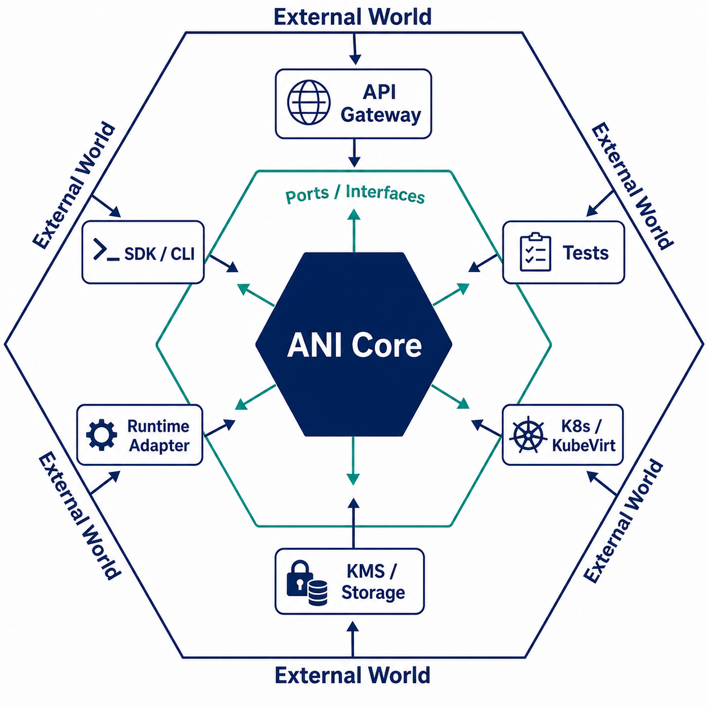
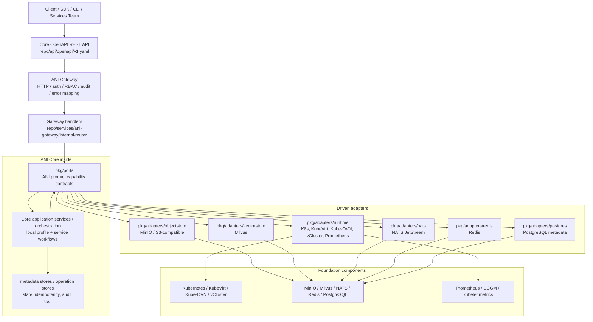
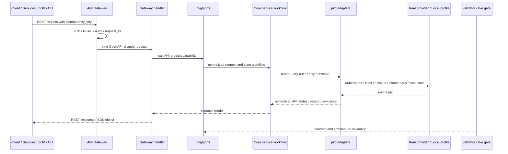

# ANI Core Hexagonal Architecture Review

> 日期：2026-06-28
> 分支：`codex/architecture-hexagonal-docs`
> 范围：仅 ANI Core 架构与文档阶段性梳理；不修改 Core 代码、不开发 Services、不调整当前 Sprint 状态。

## 1. 结论

ANI Core 当前已经采用了 Go 版本的六边形架构，准确说是 **Ports and Adapters Architecture**。它不是通过某个框架实现的，而是通过 Go interface、`pkg/ports` 能力边界、`pkg/adapters` 默认实现、Gateway handler 依赖注入、bootstrap composition root、架构守卫脚本和 live gate 共同落地。

当前实现的强证据如下：

| 维度 | 本项目证据 | 结论 |
|---|---|---|
| 强制规则 | `CLAUDE.md` 要求 Core 能力必须经过 `pkg/ports` 和 `pkg/adapters`，禁止业务服务直接依赖底层组件 SDK | 架构不是建议，而是工程约束 |
| 架构文档 | `ANI-05-系统架构设计.md` 明确 `Gateway/Core services -> ports -> adapters -> components` | 文档层已定义六边形边界 |
| 代码结构 | `repo/pkg/ports` 有 22 个 Go 文件、63 个接口定义；`repo/pkg/adapters` 有 64 个非测试 Go 实现文件 | 代码层已经拆出能力端口和适配器 |
| 装配方式 | `repo/pkg/bootstrap/deps.go` 将具体 adapter 装配到 `ports.*` 能力集合 | 依赖方向由 composition root 控制 |
| HTTP 入口 | `repo/services/ani-gateway/internal/router` handler 通过 `ports.*` 调用 Core 能力 | Gateway 是 driving adapter，不直接操作底层组件 |
| 组件接入 | MinIO、Milvus、Redis、NATS、Kubernetes REST 等只出现在 adapter/bootstrap 允许区域 | 底层组件没有扩散成产品语义 |
| 架构门禁 | `make validate-architecture` 执行 `scripts/validate_component_imports.py` | 依赖边界可自动验证 |

因此，本项目不是“使用了一些 interface”，而是已经形成了 **面向基础设施能力的六边形控制平面架构**。

## 2. 外部理论与最佳实践

### 2.1 Cockburn 原始定义

Alistair Cockburn 在 2005 年提出 Hexagonal Architecture，也称 Ports and Adapters。原始文章的核心意图是：让应用可以脱离 UI、数据库和最终运行设备进行开发、测试和自动化回归；外部事件从 port 进入，技术相关 adapter 将其转换成应用可理解的调用；应用不知道 adapter 另一侧是什么技术。

#### 2.1.1 “六边形”名字的由来与正确解读

“六边形架构”的正式名称是 **Ports and Adapters Architecture**，中文更准确地说是“端口与适配器架构”。“Hexagonal Architecture”这个名字来自 Cockburn 原始文章中的图形表达：他用一个多边形把 application core 画在中间，周围的每一条边都可以连接一种 port，再由 adapter 把外部技术世界接入应用。

因此，“六边形”不是指项目必须有六个模块、六层结构或六类 adapter；六这个数字本身并不是架构约束。它主要是一个可视化隐喻，用来提醒设计者：

- Core 在中心，承载应用语义和用例编排。
- Ports 是 Core 的边界协议，可以是被外部驱动的 inbound port，也可以是 Core 调用外部能力的 outbound port。
- Adapters 在 Core 外侧，负责把 HTTP、CLI、SDK、测试、数据库、Kubernetes、KMS、对象存储等具体技术转换成 port 能理解的调用。
- External world 在最外侧，可以从多个方向驱动 Core，也可以被 Core 通过 outbound adapter 调用。

这也解释了为什么不应把六边形架构画成“外部世界在上、Core 在中、ports/adapters 都在 Core 下面”的传统上下分层图。上下图只能表达调用顺序，不能准确表达六边形架构最重要的内外边界。更准确的理解是：

```text
External World
  -> Adapters
    -> Ports / Interfaces
      -> Core
    -> Ports / Interfaces
  -> Adapters
External World
```

在 ANI Core 中，“六边形”应被解释为：Core 位于中心；`pkg/ports` 是 Core 的产品能力边界；`pkg/adapters` 围绕 Core 接入 Kubernetes、KubeVirt、KMS、MinIO、Milvus、Prometheus 等外部能力；Gateway、SDK、CLI、测试和 live gate 从外侧驱动 Core。

对 ANI Core 的映射：

| Cockburn 理论 | ANI Core 实现 |
|---|---|
| Application inside | Core 基础设施产品语义：实例、网络、存储、K8s、加密、Secret、计量、观测 |
| Port protocol | `pkg/ports/*.go` 中的 Go interface 和请求/响应结构 |
| Driving adapters | Gateway REST handler、SDK/CLI、live gate/test harness |
| Driven adapters | Kubernetes REST、Kube-OVN、Rook-Ceph/CSI、MinIO、Milvus、Prometheus、Redis、NATS、PostgreSQL 等实现 |
| Mock/local adapter | local profile、not_configured adapter、metadata-backed local store |

参考：Alistair Cockburn, "Hexagonal architecture the original 2005 article"

https://alistair.cockburn.us/hexagonal-architecture/

### 2.2 AWS Prescriptive Guidance

AWS 的 Hexagonal Architecture pattern 强调：

- 目标是低耦合，应用组件可独立测试，不依赖数据存储或 UI。
- port 是技术无关的入口，adapter 将具体技术交换转换到 port 协议。
- 适用于多个客户端共享同一领域逻辑、UI/数据库需要周期性替换、输入输出来源多样的系统。
- 代价包括额外 adapter 维护成本、复杂度和可能的额外延迟。

对 ANI Core 的启发：

| AWS 建议 | 本项目对应 |
|---|---|
| 业务逻辑与基础设施隔离 | `pkg/ports` 表达 ANI 产品能力，`pkg/adapters` 才连接组件 |
| 防止技术锁定 | MinIO/Milvus/Kube-OVN/Prometheus 是默认 adapter，不是外部 API 语义 |
| 支持多个输入/输出 | Gateway、SDK、CLI、local profile、real provider、live gate 共用 Core 能力边界 |
| 注意复杂度与延迟 | 本项目应避免为一次性实现新增 port，并保持 adapter 内部性能可控 |

参考：AWS Prescriptive Guidance, "Hexagonal architecture pattern"

https://docs.aws.amazon.com/prescriptive-guidance/latest/cloud-design-patterns/hexagonal-architecture.html

### 2.3 DORA 对低耦合架构的研究支持

DORA 的 "Loosely coupled teams" capability 不是直接为六边形架构背书，但它给出了重要的组织与交付数据逻辑：高绩效交付依赖团队可以独立修改、测试、部署和发布系统，不需要细粒度跨团队协调；服务应能按需测试，并通过 mocking/stubbing、contract testing 和版本化 API 降低外部依赖影响。

对 ANI Core 的启发：

- Core 与 Services 的团队边界必须通过 OpenAPI/SDK 和 ports/adapters 固化，而不是通过内部包共享。
- Services 团队不应依赖 Core 内部实现、Kubernetes SDK 或组件 SDK。
- local profile、mock server、SDK smoke test、live gate 是架构先进性的工程化支撑，不只是测试补丁。

参考：DORA, "Loosely coupled teams"

https://dora.dev/capabilities/loosely-coupled-teams/

### 2.4 CNCF 数据对本项目技术路线的支撑

CNCF 2024 Annual Survey 的关键数据：

- cloud native adoption 达到 89%。
- 91% 的组织在生产中使用 containers。
- Kubernetes 生产使用达到 80%，生产 + pilot/evaluation 达到 93%。
- Kubernetes 在 CNCF graduated projects 中使用率最高，85% using、9% evaluating。
- CI/CD 在 most/all applications 中的生产使用从 46% 提升到 60%，增长 31%。
- 容器使用挑战中，文化与团队变化、CI/CD、训练、复杂度仍是主要痛点。

这些数据说明：ANI Core 选择 Kubernetes/cloud-native 作为底座是符合行业主流的；但同时，cloud-native 的复杂度、团队协作和持续交付压力也要求 Core 不能把组件 SDK 无边界扩散。六边形架构在这里的先进性不是“运行更快”，而是 **在主流复杂技术栈下，把替换、测试、协作和生产验证成本控制在可管理边界内**。

参考：CNCF Annual Survey 2024 Report

https://www.cncf.io/wp-content/uploads/2025/04/cncf_annual_survey24_031225a.pdf

### 2.5 Go 语言实践边界

Go 官方 Code Review Comments 对 interface 有一个重要建议：interface 通常应定义在使用方，而不是实现方；不要为了 mock 提前定义接口，也不要在没有真实用例前定义接口。

这对本项目有两层含义：

1. 本项目把接口集中放在 `pkg/ports`，这不是普通 Go 小项目的默认写法。
2. 这个选择在 ANI Core 中是有理由的，因为 `pkg/ports` 不是“为了 mock 抽接口”，而是跨 Gateway、Core service、Services、SDK、local profile、real provider、live gate 的产品能力契约层。

因此，本项目应该继续遵守一个约束：**只有承载 ANI 产品能力、存在合理替换/多实现、需要统一租户/幂等/审计/状态机/reconcile 的依赖才进入 `pkg/ports`；普通工具库和一次性实现不要被 port 化。**

参考：Go Wiki, "Go Code Review Comments - Interfaces"

https://go.dev/wiki/CodeReviewComments#interfaces

## 3. 本项目六边形架构图

### 3.1 Core 总体六边形



上图的读法是：**Core 在中心，Ports/Interfaces 是 Core 边界，Adapters 围绕 Core，External World 在最外侧**。它不是六个固定模块，也不是传统三层架构；图中的六边形只是表达“Core 可以从多个方向被驱动，也可以通过多个方向连接外部能力”的内外边界。



读图要点：

- `repo/api/openapi/v1.yaml` 是 Core 对外契约；Services 通过 Core API/SDK 调用，不 import Core 内部包。
- `repo/services/ani-gateway/internal/router` 是 driving adapter，负责 HTTP、鉴权、参数绑定、错误映射和响应结构。
- `repo/pkg/ports` 是 Core 能力边界，表达 ANI 产品意图，不表达完整 Kubernetes/MinIO/Milvus SDK。
- `repo/pkg/adapters` 是 driven adapter，负责把 ANI 能力转换成底层组件调用。
- `repo/pkg/bootstrap/deps.go` 是 composition root，决定具体使用 local、not_configured、Kubernetes REST、MinIO、Milvus、Prometheus 等实现。

### 3.2 Core 资源创建链路



### 3.3 Driving 与 Driven Adapter 映射

| 类型 | 当前实现 | 职责 |
|---|---|---|
| Driving adapter | Gateway handler | 将 HTTP/OpenAPI 请求转换成 `ports.*` 调用 |
| Driving adapter | SDK/CLI/mock/live gate | 通过 Core API 或测试入口驱动 Core 能力 |
| Application port | `ports.StorageService`、`ports.NetworkService`、`ports.WorkloadRuntime`、`ports.VectorStoreService` 等 | 定义 ANI 产品能力协议 |
| Driven adapter | `runtime.NewKubernetesRESTClient`、`NewKubeOVNNetworkProviderAdapter`、`NewKubernetesStorageProviderAdapter` | 调 Kubernetes/Kube-OVN/CSI 等底座 |
| Driven adapter | `objectstore.NewMinIOObjectStore` | 提供 S3-compatible object store |
| Driven adapter | `vectorstore.NewMilvusVectorStore` | 提供 vector collection/upsert/search |
| Driven adapter | local/not_configured adapters | 支持 local profile、缺省 fail-closed、单元测试和 contract 开发 |

## 4. 真实代码验证

### 4.1 ports 是产品能力，不是底层 SDK

`repo/pkg/ports/workload_runtime.go` 中的 `WorkloadRuntime` 注释已经明确：业务服务依赖该 port，而不是直接绑定 KubeVirt、Kubernetes Pod/Deployment API 或未来 runtime provider。

典型 port：

- `ports.WorkloadRuntime`
- `ports.WorkloadProviderDryRun`
- `ports.WorkloadProviderApply`
- `ports.WorkloadProviderStatusReader`
- `ports.StorageService`
- `ports.StorageProviderRenderer`
- `ports.NetworkService`
- `ports.GPUInventory`
- `ports.ObjectStore`
- `ports.VectorStore`
- `ports.InstanceObservability`

这些接口描述的是 ANI 产品意图：工作负载、网络、存储、对象、向量、GPU、观测、加密、Secret。它们没有把完整 K8s SDK、MinIO SDK、Milvus SDK 泄漏给 Gateway 或 Services。

### 4.2 adapters 才连接真实组件

本地抽样证据：

| Adapter | 实现 |
|---|---|
| Kubernetes | `repo/pkg/adapters/runtime/kubernetes_rest_client.go` |
| Kube-OVN | `repo/pkg/adapters/runtime/kubeovn_network_provider.go`、`kubeovn_network_renderer.go` |
| Rook-Ceph/CSI via K8s | `repo/pkg/adapters/runtime/storage_provider.go`、`storage_renderer.go` |
| MinIO | `repo/pkg/adapters/objectstore/minio_store.go` |
| Milvus | `repo/pkg/adapters/vectorstore/milvus_store.go` |
| Prometheus | `repo/pkg/adapters/runtime/prometheus_instance_observability.go` |
| NATS | `repo/pkg/adapters/nats/message_bus.go` |
| Redis | `repo/pkg/adapters/redis/cache_store.go` |
| PostgreSQL metadata | `repo/pkg/adapters/postgres/metadata_store.go` |

例如 `MinIOObjectStore` 显式声明实现 `ports.ObjectStore`；`MilvusVectorStore` 显式声明实现 `ports.VectorStore`；`KubernetesSecretProviderAdapter` 声明实现 `ports.SecretProviderApply`。这是典型 driven adapter。

### 4.3 Gateway handler 依赖 port

`repo/services/ani-gateway/internal/router/router.go` 的 `RegisterOptions` 注入了：

- `ports.K8sClusterService`
- `ports.EncryptionService`
- `ports.SecretService`
- `ports.GPUInventory`
- `ports.NetworkService`
- `ports.StorageService`
- `ports.VectorStoreService`
- `ports.InstanceObservability`

`storage_resources.go` 中的 `storageAPI` 持有 `ports.StorageService`，handler 只负责绑定 JSON、拼接 `ports.StorageVolumeCreateRequest`、调用 port、映射错误和响应。它没有直接操作 Kubernetes、MinIO 或数据库。

这正是六边形架构的 driving adapter：外部 HTTP 协议在边界处被转换为内部能力调用。

### 4.4 bootstrap 是 composition root

`repo/pkg/bootstrap/deps.go` 的 `Capabilities` 是项目当前最清晰的 composition root。它把外部组件和本地 profile 统一装配成 `ports.*`：

- `ObjectStore ports.ObjectStore`
- `VectorStore ports.VectorStore`
- `GPUInventory ports.GPUInventory`
- `WorkloadRuntime ports.WorkloadRuntime`
- `NetworkResources ports.NetworkService`
- `StorageResources ports.StorageService`

配置开关如 `StorageProvider`、`ObjectStoreProvider`、`VectorStoreProvider`、`GPUInventoryProvider` 决定装配 local、not_configured 或真实 provider。这样 Gateway/Core 上层代码不需要知道具体 provider 的构造细节。

### 4.5 architecture guard 已经自动化

`repo/scripts/validate_component_imports.py` 将 MinIO、Milvus、NATS、Redis、Harbor、Dex/OIDC 等组件 SDK import 标为受控依赖，并只允许它们出现在：

- `pkg/adapters`
- `pkg/bootstrap`
- allowlist 明确登记的 bounded module

`repo/Makefile` 中 `validate-architecture` 固定调用该脚本。这个门禁解决了 Cockburn 原文中提到的问题：仅靠口头承诺很容易让逻辑越界，必须有机制检测边界违反。

本次本地执行结果：

```text
make validate-architecture
component import guard passed
```

## 5. 为什么 ANI Core 应采用六边形架构

### 5.1 从项目目标看

ANI Core 的目标不是实现某一个应用，而是交付 AI-Native Infrastructure 的基础设施平台底座。它需要输出稳定的 Core OpenAPI REST API、SDK 和 CLI，支撑 Services 团队在其上实现模型、知识库、RAG、Console/BOSS、Agent 等产品能力。

这意味着 Core 的长期风险不是“今天少写几层代码”，而是：

- 底层组件升级或替换导致外部 API 被迫变化。
- Services 直接依赖 Core 内部包，形成不可控耦合。
- 本地开发、真实 provider、生产门禁三套路径不一致。
- AI Coding Team 在不同切片上并行开发时互相踩边界。

六边形架构把这些风险变成可控边界：OpenAPI 稳定、port 表达产品能力、adapter 承担底层组件变化、live gate 验证真实 provider。

### 5.2 从 Core / Services 分工看

当前项目强制规定：

- 本仓库只负责 ANI Core。
- Services 已冻结并移交外部产品团队。
- Services 只能通过 Core OpenAPI/SDK 调用 Core。
- Core 禁止调用 Services 代码。
- Services 业务资源不得回流 Core API。

这正是六边形架构适用场景：Core 作为被多个上层产品/团队消费的基础能力层，需要把外部 API、内部能力接口、底层组件实现严格分开。

Core 团队可以独立推进：

- `pkg/ports` 能力补齐。
- local profile。
- real provider adapter。
- live gate 和 evidence。
- SDK/mock/doc。

Services 团队可以独立推进：

- 产品功能和交互。
- Services API。
- 业务 mock。
- 通过 Core SDK 组合基础设施能力。

两边通过 OpenAPI/SDK 和能力语义协作，而不是共享内部包。

### 5.3 从 AI Coding Team 效率看

AI Coding Team 适合在清晰边界上并行工作。六边形架构为 AI 协作提供了天然任务切片：

| AI 子任务 | 适合修改范围 | 验证方式 |
|---|---|---|
| 新 Core API | `api/openapi/v1.yaml`、Gateway handler、SDK smoke | OpenAPI validator、SDK/mock smoke |
| 新产品能力 port | `pkg/ports`、对应 local adapter、handler test | unit test、architecture guard |
| 新真实 provider | `pkg/adapters/*`、bootstrap config、live gate | provider test、live evidence |
| 架构守卫 | `scripts/validate_*`、Makefile target | validator test |
| 文档归档 | `repo/development-records/*.md` | doc-entrypoint guard、diff check |

如果没有 ports/adapters，AI 很容易在 handler 中直接拼 Kubernetes 对象、在 Services 中直接 import Core 包，短期快，长期返工巨大。

### 5.4 从性能看

六边形架构本身不是性能优化模式，也不能声称“多一层 adapter 会更快”。AWS 也明确提醒额外层可能带来 latency。ANI Core 采用它的性能理由是另一种：

- 快路径由真实 adapter 内部优化，而不是由上层业务直接绑定 SDK。
- adapter 可以保留底层组件高级能力，例如 Kubernetes server-side dry-run、apply、status observation、MinIO pre-signed URL、Milvus search API。
- Gateway/port 层只承载控制面语义，数据面大流量尽量通过预签名 URL、provider-native API 或异步任务承载。
- 可以按能力独立调优：object store、vector store、observability、workload runtime 各自优化，不让所有调用混在一个巨型服务层。

因此，性能策略是：**控制面保持稳定抽象，adapter 内部保留底层性能能力，避免业务层被底层 API 污染。**

### 5.5 从扩展性看

ANI Core 面向的底座不是单组件：

- Kubernetes / KubeVirt / Kube-OVN / vCluster。
- Rook-Ceph / CSI / StorageClass / PVC。
- MinIO / S3-compatible object store。
- Milvus / future vector backend。
- Prometheus / DCGM / kubelet。
- Redis / NATS / PostgreSQL / Harbor / Dex 等。

外部数据也说明 cloud-native 和 Kubernetes 已经成为主流，但组件生态仍然复杂且持续变化。六边形架构允许 ANI 先选成熟默认组件，同时保留替换路径：

- MinIO 可以换成其他 S3-compatible 实现。
- Milvus 可以换成其他 vector backend。
- Kube-OVN 可以被其他网络 provider 替换。
- Prometheus 查询可以被其他 observability backend 替换。
- local profile 可以服务快速开发和 contract-first 联调。

扩展性来自“能力稳定 + adapter 可替换”，不是来自提前堆很多抽象。

### 5.6 从工程效率看

六边形架构让项目可以采用分阶段成熟度：

| 阶段 | 含义 | 本项目例子 |
|---|---|---|
| contract | OpenAPI/schema/SDK 定义完成 | `api/openapi/v1.yaml` |
| local-profile | handler、port、local adapter、状态机完成 | Sprint 12 19 个 handler + 2 个 422 |
| real-provider | 接入真实组件并有 live gate | Sprint 13 S01-S07 production-shaped gate |
| production-ready | HA、故障注入、readyz、重试、降级、failover、soak | Sprint 14 resilience live gate 局部证明 |

这套分层特别适合 AI Coding 快速循环：先稳定契约，再补 local adapter，再接真实 provider，最后补生产语义。

## 6. 当前实现的优点

1. **边界已自动化验证。** `validate-architecture` 能防止底层 SDK 无边界扩散。
2. **契约优先。** Core API 以 OpenAPI 为唯一真实来源，SDK/mock/doc 都围绕契约生成或验证。
3. **local 与 real provider 能并行。** 本地开发不依赖真实底座，真实 provider 又有 live gate 和 evidence。
4. **底层组件默认但不固化。** MinIO、Milvus、Kube-OVN、Prometheus 等是 adapter，不是外部 API 语义。
5. **适合 AI 团队分工。** API、handler、port、adapter、gate、doc 可以独立切片。
6. **安全和生产边界清楚。** Secret、KMS、RBAC、审计、幂等、fail-closed 都可以在 port/adapter workflow 中统一收敛。

## 7. 当前实现的风险与不足

### 7.1 `pkg/adapters/runtime/local_*` 命名承载了部分 application service 逻辑

从 textbook 六边形架构看，application core 通常独立于 adapters；而本项目中一些 `runtime.Local*Service` 同时承担：

- local profile 实现；
- 产品状态机；
- 幂等逻辑；
- provider renderer/dry-run/apply 编排；
- metadata store 写入。

这在当前阶段是可以接受的，因为 Core 仍在快速收敛 local profile 和 real provider。但长期看，文档应明确：`pkg/adapters/runtime` 下的 `Local*Service` 是当前 Core service workflow 的实现载体，不只是“外部技术 adapter”。

建议：

- 短期：在架构文档中解释该命名，不做大重构。
- 中期：当某能力稳定后，可考虑把纯 workflow/orchestrator 抽到更明确的 Core service package，adapter 只保留底层技术转换。

### 7.2 `pkg/ports` 集中定义与 Go idiom 有张力

Go 官方一般建议 interface 放在使用方，不要为了 mock 提前定义。ANI Core 当前集中定义 `pkg/ports` 是合理例外，因为这些接口是产品能力契约，不是实现方为了测试自己而定义。

风险是 port 膨胀。

建议：

- 新增 port 前必须满足 CLAUDE.md 的条件：承载产品能力、会被 Core/Services/API handler 依赖、存在合理替换/多实现可能。
- port 方法不应直接暴露底层 SDK 类型。
- port 不应因某个单一 adapter 的便利而增加字段。

### 7.3 需要区分 control plane 与 data plane

Core API 是控制面契约。对象上传下载、日志流、exec、proxy、vector ingestion 等可能具有数据面特征。六边形架构不能成为所有数据都穿 Gateway 的理由。

建议：

- 控制面走 OpenAPI/port。
- 大对象走 pre-signed URL 或 provider-native path。
- 长连接/stream/proxy 明确标注边界、鉴权、审计和回压策略。

### 7.4 架构先进性不能被误写成“性能天然更好”

六边形架构的先进性来自：

- 可替换性；
- 可测试性；
- 独立交付；
- 低耦合团队协作；
- 真实 provider 与 local profile 可并行。

它不是低延迟模式。任何新增 adapter 层都要注意调用链、序列化、超时、重试、连接池和批处理。

### 7.5 文档应把“理论体系”和“代码事实”固定在一起

当前 `ANI-05` 和 `ANI-13` 已经描述 ports/adapters，但还缺少一份面向新成员的“理论 + 本项目真实代码映射 + 为什么采用”的完整讲解文档。本文件可作为该阶段性补充。

## 8. 完善建议

### P0：保持现有边界门禁

- `make validate-architecture` 必须继续作为提交门禁。
- 新增组件 SDK import 必须落在 adapter/bootstrap 或 allowlist bounded module。
- Gateway handler 不得直接拼 Kubernetes/MinIO/Milvus 对象。
- Services 不得 import Core 内部包。

### P1：补一张正式 Core Hexagonal 架构图到长期架构文档

建议后续在 `ANI-05-系统架构设计.md` 或独立架构说明中补充：

- driving adapters；
- application ports；
- driven adapters；
- composition root；
- local profile / real provider / production-ready 成熟度；
- Core/Services 团队边界。

### P1：为新增能力建立 port 审查清单

新增 port 前回答：

1. 这是 ANI 产品能力，还是某个组件的技术细节？
2. 是否会被 Gateway/Core service/Services/SDK 调用？
3. 是否存在合理替换、多实现或云厂商差异？
4. 是否需要统一租户、幂等、审计、错误语义、状态机或 reconcile？
5. 是否泄漏了底层 SDK 类型、资源名或 provider 特有字段？
6. 是否有 local profile、not_configured 或 fake adapter 支撑测试？
7. 是否有 contract/local/real-provider/production-ready 的成熟度标记？

### P2：长期拆分 application workflow 与 technical adapter

如果某些 `Local*Service` 文件继续增长，可以按能力逐步拆成：

- `pkg/core/<capability>`：产品状态机、幂等、审计、reconcile workflow。
- `pkg/adapters/<provider>`：底层组件转换、请求签名、REST/SDK 调用、错误映射。

短期不建议为“看起来更纯”而重构，因为当前代码已经可验证，且 Sprint 13/14 的重点是真实 provider 和生产语义闭环。

## 9. 先进性评价

本项目六边形架构的先进性不是来自术语，而来自四个事实：

1. **行业方向匹配。** CNCF 数据显示 cloud-native、containers、Kubernetes 已是主流；ANI Core 选择 Kubernetes 作为底座具有行业基础。
2. **复杂度治理匹配。** CNCF 同时显示容器/K8s 的挑战集中在团队、CI/CD、训练、复杂度；ports/adapters 正是把复杂度收进可管理边界。
3. **交付组织匹配。** DORA 强调低耦合团队、独立测试、独立部署、contract testing 和版本化 API；Core/Services 分工正需要这种边界。
4. **工程可验证。** 本项目不是只画架构图，而是已有 `validate-architecture`、OpenAPI/SDK/mock smoke、local profile、live gate、evidence JSON 和 production-shaped guard。

更准确的评价是：

```text
ANI Core 当前采用的是 cloud-native 基础设施平台场景下合理且先进的六边形架构变体。
它的先进性体现在长期演进、团队协作、组件替换、测试自动化和真实 provider 验证。
它不保证单次调用天然更快，也不应被用来为过度抽象背书。
```

## 10. 一句话给新成员

在 ANI Core 里，先问“这是 ANI 的什么产品能力”，再找或定义 `pkg/ports`；然后用 `pkg/adapters` 把它接到 Kubernetes、MinIO、Milvus、Prometheus 等真实组件；最后通过 Gateway/OpenAPI/SDK 暴露给 Services 和客户。不要让底层组件 SDK、Services 业务语义或临时实现穿透这些边界。

## 11. 参考资料

- Alistair Cockburn, "Hexagonal architecture the original 2005 article": https://alistair.cockburn.us/hexagonal-architecture/
- AWS Prescriptive Guidance, "Hexagonal architecture pattern": https://docs.aws.amazon.com/prescriptive-guidance/latest/cloud-design-patterns/hexagonal-architecture.html
- DORA, "Loosely coupled teams": https://dora.dev/capabilities/loosely-coupled-teams/
- CNCF, "Cloud Native 2024: Approaching a Decade of Code, Cloud, and Change": https://www.cncf.io/wp-content/uploads/2025/04/cncf_annual_survey24_031225a.pdf
- Go Wiki, "Go Code Review Comments - Interfaces": https://go.dev/wiki/CodeReviewComments#interfaces
