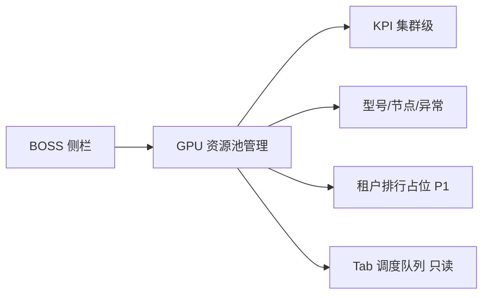

# UX: K8s GPU 调度（BOSS · GPU 资源池）

> Interaction specification derived from: [`prd-k8s-gpu-hami-volcano-scheduling.md`](./prd-k8s-gpu-hami-volcano-scheduling.md)  
> Part of ani-workflow artifact triad — next: `/prd-to-spec`  
> Generated: 2026-07-03 | Product: **BOSS** | UI stack: **TDesign React + TanStack Router**（规划，BOSS 前端骨架待落地）  
> Module main doc: [`gpu-pool-management.md`](../boss-modules/ops/gpu-pool-management.md)

---

## 1. Page Type

### 1.1 Classification

| Screen | Page type | In app shell? | Route（规划） |
|--------|-----------|---------------|---------------|
| GPU 资源池管理 | dashboard + tabs + table | yes | `/ops/gpu-pool` |
| 平台队列只读列表（可选同页 Tab） | list read-only | yes | `/ops/gpu-pool` Tab「调度队列」 |

### 1.2 Pattern Reference

| 本页 | 对齐 |
|------|------|
| 布局 | Console 模板 A + B；BOSS 与 Console **同 App Shell 规范**（`页面模板-2.0.md` §3） |
| Console 对照页 | Console `/compute/gpu`（租户 scoped） |
| 差异 | 标题/副标题强调「全平台」；租户排行 P0 占位 |

---

## 2. Information Architecture

### 2.1 Routes & Entry Points

| Route | Entry | Auth |
|-------|-------|------|
| `/ops/gpu-pool` | 侧栏「资源池与基础设施 → GPU 资源池管理」 | yes + 平台 GPU 读权限（SPEC 冻结 scope） |

### 2.2 Navigation Relationship

```text
资源池与基础设施
└── GPU 资源池管理 (/ops/gpu-pool)
    ├── （可选）跳转 GPU 监控专页 — P1
    └── （可选）跳转 节点状态 — 外链 node-status
```

**Breadcrumb：** `资源池与基础设施 / GPU 资源池管理`

**与 Console 分工（页内 Alert 常驻）：**

> 本页展示**全平台** GPU 资源池状态。租户视角请使用 Console「GPU 算力管理」。

### 2.3 PRD Coverage Map

| PRD item | Screen / section |
|----------|------------------|
| US-007 | `/ops/gpu-pool` 全域 |
| §10.3 BOSS aggregate | KPI + 占位排行区 |
| §10.4 DCGM | 可选集群利用率 KPI（与 Console 同源 observability） |
| §10.5 队列 | Tab「调度队列」只读全览 |

---

## 3. User Flow

### 3.1 平台管理员：巡检全平台 GPU

```text
进入 BOSS → GPU 资源池管理
  → 加载集群级 occupancy + inventory（平台管理员可读范围，SPEC 定义）
  → 查看 KPI：总量 / 已分配 / 空闲 / 异常
  → 查看型号分布、节点列表
  → Tab「异常设备」：筛选 status=fault|maintenance
  → 滚至「租户占用排行」→ 阅读占位 Alert（P1）
  → 点击「刷新」更新数据
```

### 3.2 平台管理员：查看平台默认队列（只读）

```text
Tab「调度队列」
  → 列表展示 ani-inference / ani-training + 各租户自定义队列（只读）
  → 无新建/编辑/删除（P0 BOSS 不写队列；运维维护走平台工具，SPEC）
```

### 3.3 Flow Diagram



---

## 4. Layout Regions

### 4.1 GPU 资源池管理（主页面）

```text
┌─────────────────────────────────────────────┐
│ PageHeader: GPU 资源池管理（全平台）| [刷新]  │
│ 副标题: 集群级 GPU 容量与设备状态             │
├─────────────────────────────────────────────┤
│ Alert theme=info                             │
│  本页为全平台视图；租户视角见 Console        │
├─────────────────────────────────────────────┤
│ KPI Row: 总量 | 已分配 | 空闲 | 异常设备      │
│ （P0 无「平均利用率」强制要求；可选第四卡）    │
├─────────────────────────────────────────────┤
│ Section: 型号分布（by_gpu_type）             │
├─────────────────────────────────────────────┤
│ Tabs: 节点 | 异常设备 | 调度队列             │
│  Table ...                                   │
├─────────────────────────────────────────────┤
│ Section: 租户占用排行                        │
│ ┌─────────────────────────────────────────┐ │
│ │ Alert theme=info                         │ │
│ │  租户维度排行待平台 API（P1）            │ │
│ │  当前不展示排行数据                      │ │
│ └─────────────────────────────────────────┘ │
└─────────────────────────────────────────────┘
```

| Region | Content | P0 行为 |
|--------|---------|---------|
| header | 全平台标题 + 刷新 | 常规定义 |
| scope-alert | Console 对照说明 | 常驻 info |
| kpi | `GPUOccupancyStats` 集群级 | total/in_use/available/fault |
| distribution | `by_gpu_type` | 与 Console 同组件模式 |
| tabs | 节点 / 异常 / 队列 | Table |
| tenant-rank | **仅占位** | **禁止** Table 假数据 |

---

## 5. Component Mapping

| UI element | TDesign | Props / variant | Data source |
|------------|---------|-----------------|-------------|
| 页面壳 | `Layout` + PageHeader 模式 | 与 Console shell 同规范 | — |
| 范围说明 | `Alert` | `theme="info"`, closable=false | 静态文案 |
| KPI | `Statistic` / Card grid | 4 列 | 集群 occupancy |
| 型号分布 | `Progress` 或 Chart | — | `by_gpu_type` |
| Tab | `Tabs` | | |
| 节点表 | `Table` | 聚合 inventory by node | `listGPUInventory` 平台视图（SPEC） |
| 异常表 | `Table` | filter fault+maintenance | 同上 |
| 队列表 | `Table` | **无操作列** | `GET /gpu-scheduling/queues` 平台只读列表（SPEC） |
| 排行占位 | `Alert` | 在 SectionCard 内 | 静态 |
| 刷新 | `Button` | outline | refetch |
| 状态 Tag | `Tag` | 同 Console 映射 | `status` |

**节点 Table 列（P0）：**

| 列 | 字段 |
|----|------|
| 节点 | `node_name` |
| GPU 总数 | 聚合 count |
| 已用 | 聚合 in_use |
| 空闲 | 聚合 available |
| 异常数 | fault count |

**异常设备 Table 列：** 同 Console 设备 Tab（`node_name`, `gpu_type`, `gpu_index`, `status`）；**不展示 tenant 排行列**。

**调度队列 Table 列（只读）：**

| 列 | 字段 |
|----|------|
| 队列名称 | `name` |
| 类型 | `workload_class` |
| 权重 | `weight` |
| 可回收 | `reclaimable` → 是/否 |
| 范围 | 平台默认 / 租户（SPEC 字段） |

---

## 6. State Design

| State | Trigger | UI behavior | Components |
|-------|---------|-------------|------------|
| loading | 首次/刷新 | KPI Skeleton；Table loading | `Skeleton` |
| idle | 200 + 有数据 | 正常渲染 | — |
| empty-cluster | total=0 | KPI 为 0；`Empty`「集群暂无 GPU 设备」 | `Empty` |
| rank-placeholder | 始终 P0 | 排行 Section 只显示 Alert，**不渲染空 Table** | `Alert` |
| error | 5xx | 页顶 `Alert theme="error"` + 重试 | `Alert` |
| forbidden | 403 | 「无权查看平台 GPU 资源池」 | `Alert` |
| partial-data | occupancy OK, inventory fail | KPI 可用；Tab `Alert warning`「设备列表加载失败」 | 分区错误 |

**禁止态（PRD §10.3）：**

| 禁止行为 | UI 处理 |
|----------|---------|
| 前端循环调多租户 inventory 拼排行 | 不实现；P0 仅占位 |
| 自造 aggregate API 字段 | 列不引用未冻结 schema |

---

## 7. Copy & Feedback

### 7.1 Labels & Buttons

| Element | Copy (zh-CN) |
|---------|--------------|
| 页面标题 | GPU 资源池管理 |
| 副标题 | 查看全平台 GPU 容量、设备状态与调度队列（只读） |
| 范围 Alert | 本页展示全平台 GPU 资源池。租户内资源请前往 Console「GPU 算力管理」。 |
| 排行占位标题 | 租户占用排行 |
| 排行占位正文 | 租户维度排行待平台 API（P1）。当前版本不展示跨租户占用排名。 |
| 刷新 | 刷新 |

### 7.2 Messages

| Scenario | Type | Copy |
|----------|------|------|
| 加载失败 | `Message.error` | 加载 GPU 资源池数据失败，请稍后重试 |
| 刷新成功 | 无 toast | 静默更新 `refreshed_at` |
| 无权限 | `Alert` error | 无权查看平台 GPU 资源池 |

---

## 8. Boundaries & Non-Goals

### 8.1 In Scope (UX)

- 全平台集群级 KPI、型号分布、节点与异常设备列表
- 调度队列只读全览
- 租户排行 **占位说明**（P1 替换为真实 Table）
- loading / empty / error 三态

### 8.2 Explicitly Out of Scope (UI)

- P0 **无**租户 Top N 数据表格
- P0 **无**队列新建/编辑/删除（租户在 Console；平台运维工具 SPEC）
- P0 **无** GPU drain / 维护写操作（Phase 2 maint-skills）
- 不展示 HAMi / Volcano 术语
- 不循环调用租户 API 聚合

### 8.3 Open UX Questions

- BOSS 前端仓库尚未落地（`repo/frontends/boss/` 不存在）：壳层与路由在 BOSS 首期 SPEC 与 Console 对齐后实施
- 集群级 `listGPUInventory` / `getGPUOccupancy` 的平台管理员调用方式由 SPEC 冻结（非本 UX 自造路径）

### 8.4 Assumptions

- BOSS App Shell 侧栏分组以 `boss-modules/ops/` 为准；视觉与 Console 共用 TDesign Token（`产品设计规范-TDesign组件与Token-2.0.md`）
- P1 平台 aggregate API 上线后，排行 Section 替换为 `Table`（列：排名、租户、已用 GPU、占比、趋势），本 UX 预留 Section 位置不变
- 实现后浏览器验证：loading、empty-cluster、error、rank-placeholder 四态
