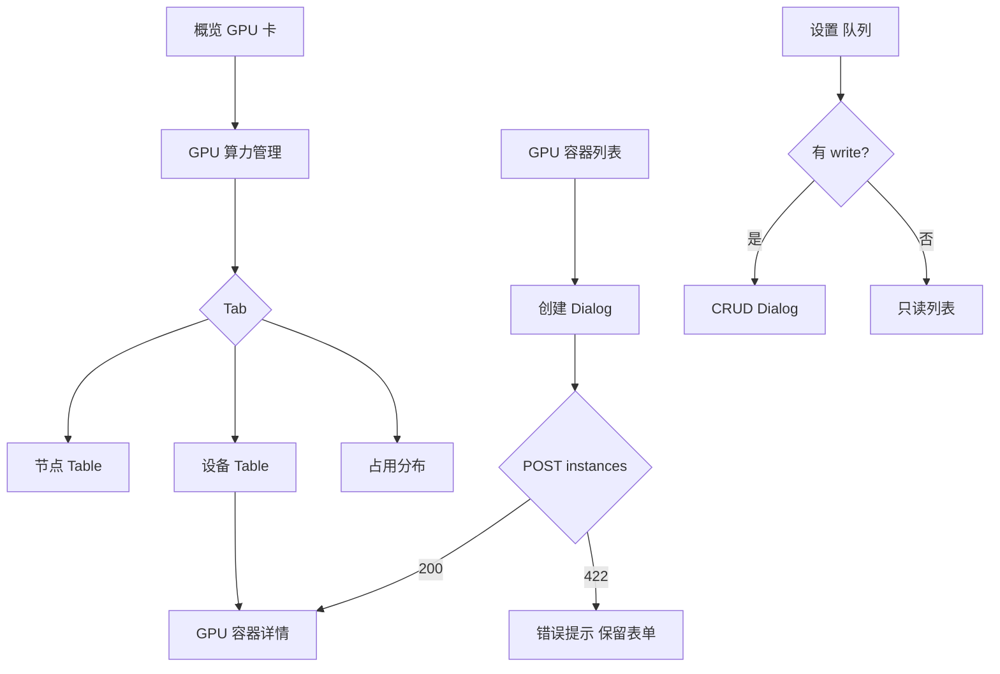

# UX: K8s GPU 调度（Console）

> Interaction specification derived from: [`prd-k8s-gpu-hami-volcano-scheduling.md`](./prd-k8s-gpu-hami-volcano-scheduling.md)  
> Part of ani-workflow artifact triad — next: `/prd-to-spec`  
> Generated: 2026-07-03 | Product: **Console** | UI stack: **TDesign React + TanStack Router**  
> Module main doc: [`gpu-management.md`](../console-modules/compute/gpu-management.md)、[`gpu-container-instance-management.md`](../console-modules/compute/gpu-container-instance-management.md)

---

## 1. Page Type

### 1.1 Classification

| Screen | Page type | In app shell? | Route（规划） |
|--------|-----------|---------------|---------------|
| 平台概览 · GPU 摘要卡 | dashboard fragment | yes | `/_authenticated/`（区块，非独立路由） |
| GPU 算力管理 | dashboard + tabs + table | yes | `/compute/gpu` |
| GPU 容器实例列表 | list | yes | `/compute/gpu-containers` |
| 创建 GPU 容器 | dialog form | yes | 从列表页打开 Dialog |
| GPU 容器详情 | detail | yes | `/compute/gpu-containers/$instanceId` |
| GPU 调度队列 | list + dialog form | yes | `/settings/gpu-queues` |

### 1.2 Pattern Reference

| 本页 | 对齐现有实现 / 模板 |
|------|---------------------|
| 平台概览 GPU 卡 | `repo/frontends/console/src/routes/_authenticated/index.tsx` + `useGpuOverview`；模板 A §4 |
| GPU 算力管理 | 模板 A（KPI + 图表）+ 模板 B（Tab 内 Table）；`ConsolePage` / `ConsolePageHeader` / `ConsoleContentCard` |
| GPU 容器列表 | `models/index.tsx` 列表模式；模板 B §5 |
| 创建 GPU 容器 | 模板 E 表单 Dialog；`POST /api/v1/instances` |
| GPU 调度队列 | 模板 B 列表 + Dialog 新建/编辑；`settings/api-keys.tsx` 设置页分组 |

---

## 2. Information Architecture

### 2.1 Routes & Entry Points

| Route | Entry | Auth |
|-------|-------|------|
| `/` | 侧栏「概览」；GPU 卡「查看详情」→ `/compute/gpu` | yes |
| `/compute/gpu` | 侧栏「算力与云资源 → GPU 算力管理」 | yes + `scope:gpu-inventory:read` |
| `/compute/gpu-containers` | 侧栏「算力与云资源 → GPU 容器实例」；GPU 页占用行链接 | yes + instances read |
| `/compute/gpu-containers/$instanceId` | 列表行点击 | yes |
| `/settings/gpu-queues` | 侧栏「设置 → GPU 调度队列」 | yes + `scope:gpu-scheduling:read` |

### 2.2 Navigation Relationship

```text
概览 (/)
└── GPU 利用率卡 ──link──► GPU 算力管理 (/compute/gpu)

算力与云资源
├── GPU 算力管理 (/compute/gpu)
│   └── 设备行「占用实例」──► GPU 容器详情
├── GPU 容器实例 (/compute/gpu-containers)
│   └── [创建 GPU 容器] Dialog
└── （批任务 P0 可选，本 UX 不展开）

设置
└── GPU 调度队列 (/settings/gpu-queues)
```

**Breadcrumb 示例：** `算力与云资源 / GPU 算力管理`

### 2.3 PRD Coverage Map

| PRD item | Screen / section |
|----------|------------------|
| US-004a | `/settings/gpu-queues` |
| US-005 | 全站 GPU 读 API |
| US-006 | `/compute/gpu` |
| US-008 | 创建 Dialog + 列表 + 详情 `state_reason` / `gpu` 摘要 |
| §10.1 虚拟化 | 创建 Dialog · Radio「整卡 / vGPU 切片」 |
| §10.4 DCGM | `/compute/gpu` · KPI「平均利用率」 |
| §10.5 RBAC | 队列页按钮显隐；创建表单队列下拉 |

---

## 3. User Flow

### 3.1 租户用户：查看 GPU 是否紧张

```text
进入「概览」
  → 扫读 GPU 卡（总量/已用/空闲）
  → 点击「查看 GPU 算力管理」
  → /compute/gpu 加载 occupancy + inventory
  → 查看 KPI 五卡 + 型号分布
  → 切 Tab「设备」，筛选 status=fault
  → 点击 instance_id 链接 → GPU 容器详情
```

### 3.2 租户管理员：配置队列并创建 GPU 容器

```text
进入「设置 → GPU 调度队列」
  → 查看平台默认队列（只读）
  → 点击「新建队列」→ Dialog 填写 → POST queues → Message.success → 列表刷新
  → 进入「GPU 容器实例」→「创建 GPU 容器」
  → 选工作负载类型 / 调度队列 / GPU 分配模式
  → 提交 POST /instances（idempotency_key）
  → 成功：跳转详情或列表刷新；失败：Message.error + 保留表单
```

### 3.3 项目成员：仅选用队列

```text
进入「设置 → GPU 调度队列」
  → 只读列表（无「新建队列」、无行内编辑/删除）
  → 创建 GPU 容器时从下拉选择已有队列
```

### 3.5 创建失败或排障：查看调度原因（US-008）

```text
创建 GPU 容器返回 422
  → Dialog 内 Message.error（InsufficientGPU / QueueNotFound / GPUNodeIncompatible）
  → 用户修正表单重试，或关闭 Dialog
进入 GPU 容器详情（列表点击或创建成功跳转）
  → GET /instances/{id}
  → 若 state=failed 且 state_reason 非空：页顶 Alert 展示可读原因
  → Descriptions「GPU 与调度」展示 gpu.count / queue / scheduling_reason
```

### 3.4 Flow Diagram



---

## 4. Layout Regions

### 4.1 平台概览 · GPU 利用率卡（`/` 内区块）

```text
┌─────────────────────────────────────────────┐
│ Section: GPU 利用率                          │
│ ┌──────┐ ┌──────┐ ┌──────┐                  │
│ │总量  │ │已用  │ │空闲  │  Statistic 行    │
│ └──────┘ └──────┘                  [查看详情]│
└─────────────────────────────────────────────┘
```

| Region | Content | Notes |
|--------|---------|-------|
| metrics | `total` `in_use` `available` from occupancy | 与 `getGPUOccupancy` 对齐 |
| action | `Link` → `/compute/gpu` | 文案「查看 GPU 算力管理」 |

---

### 4.2 GPU 算力管理（`/compute/gpu`）

```text
┌─────────────────────────────────────────────┐
│ PageHeader: GPU 算力管理 | 副标题 | [刷新]    │
├─────────────────────────────────────────────┤
│ cp-metrics-grid: 5 × Statistic Card         │
│  总量 | 已分配 | 空闲 | 平均利用率 | 异常   │
├─────────────────────────────────────────────┤
│ ConsoleSectionCard: GPU 型号分布             │
│  Progress / 条形图（by_gpu_type）            │
├─────────────────────────────────────────────┤
│ Tabs: 节点 | 设备 | 占用分布                 │
│  Toolbar: Select status 筛选 | Input 搜索节点 │
│  Table + Pagination（cursor）               │
└─────────────────────────────────────────────┘
```

| Region | Content | Notes |
|--------|---------|-------|
| header | 标题 + `refreshed_at` 次要文案 | 刷新重新 fetch |
| kpi | `GPUOccupancyStats` | 利用率见 §6 特殊态 |
| chart | `by_gpu_type[]` | 无数据时 Empty |
| tab-panel | Table 列见 §5 | 设备 Tab 含 `instance_id` 链接 |

**Tab「占用分布」P0：** 按 `gpu_type` 聚合的已用/空闲条形展示；不按跨租户排行。

---

### 4.3 GPU 容器实例列表（`/compute/gpu-containers`）

```text
┌─────────────────────────────────────────────┐
│ PageHeader: GPU 容器实例 | [创建 GPU 容器]   │
├─────────────────────────────────────────────┤
│ Toolbar: Input 搜索名称 | Select 状态       │
├─────────────────────────────────────────────┤
│ Table: 名称 | 状态 | GPU摘要 | 队列 | 操作   │
│ Pagination                                  │
└─────────────────────────────────────────────┘
```

---

### 4.4 创建 GPU 容器（Dialog）

```text
┌──────────────── Dialog 560px ────────────────┐
│ 创建 GPU 容器                                 │
│ 名称 Input *                                  │
│ GPU 数量 InputNumber *（min 1）               │
│ GPU 分配模式 Radio: 整卡(默认) | vGPU 切片    │
│ 工作负载类型 Radio: 推理 | 训练               │
│ 调度队列 Select *（queues 列表）              │
│ 型号偏好 Select 可选                          │
│                    [取消]  [创建] primary     │
└──────────────────────────────────────────────┘
```

**文案约束：** 不出现 HAMi、Volcano、MIG、device plugin。

---

### 4.5 GPU 调度队列（`/settings/gpu-queues`）

```text
┌─────────────────────────────────────────────┐
│ PageHeader: GPU 调度队列 | [新建队列] write  │
├─────────────────────────────────────────────┤
│ Alert info: 平台默认队列不可修改或删除        │
│ ConsoleSectionCard: 平台默认队列 Table 只读   │
├─────────────────────────────────────────────┤
│ ConsoleSectionCard: 我的队列 Table            │
│  行操作: 编辑 | 删除（Popconfirm）write only  │
└─────────────────────────────────────────────┘
```

---

### 4.6 GPU 容器详情（`/compute/gpu-containers/$instanceId`）

```text
┌─────────────────────────────────────────────┐
│ PageHeader: {name} | state Tag | [返回列表]  │
├─────────────────────────────────────────────┤
│ Alert（条件渲染）                             │
│  state=failed 或 state_reason 非空时展示      │
├─────────────────────────────────────────────┤
│ ConsoleSectionCard: 基本信息                  │
│  Descriptions: id / name / state / image …   │
├─────────────────────────────────────────────┤
│ ConsoleSectionCard: GPU 与调度                │
│  Descriptions: gpu.count / vendor / model    │
│                queue_name / scheduling_reason │
│                state_reason（若有）            │
└─────────────────────────────────────────────┘
```

| Region | Content | Notes |
|--------|---------|-------|
| header | 实例名 + `state` Tag + 返回列表 `Link` | 生命周期操作 P0 沿用模块 doc 矩阵 |
| reason-alert | `state_reason` 映射文案 | 见 §6.5、§7.2 |
| basic | `InstanceRecord` 通用字段 | `id`, `name`, `state`, `image`, `cpu`, `memory`, `created_at` |
| gpu-sched | `gpu` 对象 + 队列名 | `queue_name` 字段名以 SPEC/OpenAPI 为准 |

**`state_reason` 展示规则：** 仅在 `state` 为 `failed`、`provisioning`（超时场景 SPEC 定义）或 API 显式返回 reason 时显示 `Alert`；`running` 且无 reason 时不展示 Alert。

---

## 5. Component Mapping

### 5.1 GPU 算力管理

| UI element | TDesign | Props / variant | Data source |
|------------|---------|-----------------|-------------|
| 页面壳 | `ConsolePage` + `ConsolePageHeader` | 模板 A overview 间距 | — |
| KPI 卡 | `Statistic` in `ConsoleSectionCard` | `cp-metrics-grid`；「异常」取 `fault` | `getGPUOccupancy` |
| 刷新 | `Button` | `variant="outline"`, icon Refresh | refetch |
| 型号分布 | `Progress` 或占位 `TrendChartPlaceholder` | theme by type | `by_gpu_type` |
| Tab | `Tabs` | `defaultValue="devices"` | — |
| 节点搜索 | `Input` | `prefixIcon` Search；筛选 `node_name` 客户端或 query | user input |
| 状态筛选 | `Select` | options: 全部/available/in_use/fault/maintenance | query `status` |
| 设备表 | `Table` | `rowKey="id"`, `loading` | `listGPUInventory` |
| 状态列 | `Tag` | available→默认, in_use→primary, fault→danger, maintenance→warning | `status` |
| 占用实例链接 | `Link` | to `/compute/gpu-containers/$id` | `instance_id` |
| 分页 | `Pagination` | cursor 模式若 API 返回 `next_cursor` | — |

**Table columns（设备 Tab，对齐 OpenAPI）：**

| 列标题 | colKey | 说明 |
|--------|--------|------|
| 节点 | `node_name` | |
| 型号 | `gpu_type` | |
| 索引 | `gpu_index` | |
| 显存 | `memory_total_mb` | 格式 `{n} MB` |
| 状态 | `status` | Tag |
| 占用实例 | `instance_id` | 空则 `—` |
| 利用率 | — | P0 若单卡 PromQL 未冻结则 `—`；不在此 invent 字段 |

**Table columns（节点 Tab）：** 由前端按 `node_name` 聚合 `listGPUInventory`（SPEC 实现细节）；列：节点名、GPU 数、已用、空闲、状态摘要。

---

### 5.2 创建 GPU 容器 Dialog

| UI element | TDesign | Data / notes |
|------------|---------|--------------|
| 名称 | `Form.FormItem` + `Input` | `name`, required |
| GPU 数量 | `InputNumber` | min 1, integer |
| 分配模式 | `Radio.Group` | 整卡 / vGPU 切片 → 映射实例创建 payload（SPEC） |
| 工作负载 | `Radio.Group` | 推理 / 训练 → 默认队列 hint |
| 调度队列 | `Select` | options from `GET /gpu-scheduling/queues` |
| 型号偏好 | `Select` | 可选；options 来自 `listGPUInventory` 去重 `gpu_type`（SPEC） |
| 提交 | `Button theme="primary"` | loading on submit |
| 幂等 | — | 客户端生成 `idempotency_key`（SPEC） |

---

### 5.3 GPU 调度队列

| UI element | TDesign | Data / notes |
|------------|---------|--------------|
| 新建 | `Button theme="primary"` | 仅 `gpu-scheduling:write` |
| 默认队列表 | `Table` | 无操作列；`is_platform_default=true` 行 |
| 我的队列表 | `Table` | 操作列：编辑、删除 |
| 新建/编辑 Dialog | `Dialog` + `Form` | 字段见下表 |
| 删除 | `Popconfirm` + `Button theme="danger" variant="text"` | DELETE queue |

**平台默认队列表列（只读，无操作列）：**

| 列标题 | colKey | 组件 | 说明 |
|--------|--------|------|------|
| 队列名称 | `name` | 文本 | 如 `ani-inference` |
| 工作负载类型 | `workload_class` | 文本 / `Tag` | inference → 推理；training → 训练；batch → 批任务 |
| 权重 | `weight` | 数字 | |
| 可被回收 | `reclaimable` | 文本 | `true` → 是；`false` → 否 |

**我的队列表列（write 用户含操作列）：**

| 列标题 | colKey | 组件 | 说明 |
|--------|--------|------|------|
| 队列名称 | `name` | 文本 | |
| 工作负载类型 | `workload_class` | 文本 / `Tag` | 同上 |
| 权重 | `weight` | 数字 | |
| 可被回收 | `reclaimable` | 文本 | 是 / 否 |
| 关联项目 | `project_id` | 文本 | 空则 `—` |
| 操作 | — | `Button variant="text"` | 编辑、删除（仅 write） |

**队列 Form 字段（对齐 PRD，待 OpenAPI 冻结）：**

| label | name | 组件 | 校验 |
|-------|------|------|------|
| 队列名称 | `name` | `Input` | 必填，租户内唯一 |
| 工作负载类型 | `workload_class` | `Select` | inference / training / batch |
| 权重 | `weight` | `InputNumber` | 正整数 |
| 可被回收 | `reclaimable` | `Switch` | 推理默认 false |
| 关联项目 | `project_id` | `Select` 可选 | P0 可选 |

---

### 5.4 GPU 容器列表

| UI element | TDesign | Data / notes |
|------------|---------|--------------|
| 创建按钮 | `Button theme="primary"` | opens Dialog |
| 名称搜索 | `Input` | 筛选 `name`（客户端或 query，SPEC） |
| 状态筛选 | `Select` | `state` 枚举 |
| 表格 | `Table` | `GET /instances?kind=gpu_container`；`rowKey="id"` |
| 分页 | `Pagination` | cursor 若 API 支持 |
| 行操作 | `Link` / `Button variant="text"` | 查看详情 → `/compute/gpu-containers/$id` |

**Table columns（列表，对齐 `InstanceRecord`）：**

| 列标题 | colKey | 组件 | 说明 |
|--------|--------|------|------|
| 名称 | `name` | `Link` | 点击进详情 |
| 状态 | `state` | `Tag` | 实例生命周期状态 |
| GPU 数量 | `gpu.count` | 数字 | 无 `gpu` 则 `—` |
| 型号 | `gpu.model` | 文本 | 无则 `—` |
| 调度队列 | `gpu.queue_name` 或 SPEC 冻结字段 | 文本 | 无则 `—` |
| 创建时间 | `created_at` | 时间 | 本地化格式 |
| 操作 | — | `Button variant="text"` | 查看详情 |

**实例 `state` Tag 变体（沿用 Console 实例页惯例）：**

| state | Tag theme | 显示文案 |
|-------|-----------|----------|
| running | success | 运行中 |
| provisioning / starting | primary | 创建中 / 启动中 |
| stopped | default | 已停止 |
| failed | danger | 失败 |
| deleting | warning | 删除中 |

---

### 5.5 GPU 容器详情

| UI element | TDesign | Props / variant | Data source |
|------------|---------|-----------------|-------------|
| 页面壳 | `ConsolePage` + `ConsolePageHeader` | 模板 C | — |
| 返回 | `Link` 或 `Button variant="text"` | to `/compute/gpu-containers` | — |
| 状态 Tag | `Tag` | 见 §5.4 state 映射 | `state` |
| 调度原因 Alert | `Alert` | `theme` 按 `state_reason` 映射 §7.2 | `state_reason` |
| 基本信息 | `Descriptions` | `column=2` | `InstanceRecord` |
| GPU 与调度 | `Descriptions` | 分组标题「GPU 与调度」 | `gpu.*` + `queue_name` |

**Descriptions 字段（GPU 与调度分组）：**

| label | 字段 | 说明 |
|-------|------|------|
| GPU 数量 | `gpu.count` | |
| 厂商 | `gpu.vendor` | 无则 `—` |
| 型号 | `gpu.model` | |
| 分配模式 | `gpu.resource_name` 或 SPEC 字段 | 展示为「整卡」/「vGPU 切片」，不展示原始 CRD 名 |
| 调度队列 | `gpu.queue_name` 或 SPEC 字段 | |
| 调度说明 | `gpu.scheduling_reason` | 有则展示 |
| 失败原因 | `state_reason` | 仅在 Descriptions 重复展示作可扫读备份；主展示用 Alert |

---

## 6. State Design

### 6.1 `/compute/gpu`

| State | Trigger | UI behavior | Components |
|-------|---------|-------------|------------|
| loading | 首次/刷新 fetch | KPI `Skeleton`；Table `loading` | `Skeleton`, Table loading |
| idle | 200 + 有数据 | 常规定义 | — |
| empty-inventory | items=[] | Tab 内 `Empty`「当前租户暂无 GPU 设备」 | `Empty` |
| empty-occupancy | total=0 | KPI 显示 0；副文案说明 | `Statistic` value 0 |
| fault-kpi | occupancy 含 `fault` | 「异常」KPI 卡显示 `fault` 整数 | `Statistic` |
| util-ready | DCGM + observability OK | 「平均利用率」显示 `%` + 窗口说明 | `Statistic` |
| util-unavailable | DCGM 未就绪或 query 失败 | KPI 卡显示「监控未就绪」；`Tooltip` 说明 | `Tag theme="default"` |
| error | 401/403/5xx | 页顶 `Alert theme="error"` + 重试按钮 | `Alert`, `Button` |
| forbidden | 403 | Alert「无权查看 GPU 资源」 | `Alert` |

### 6.2 创建 GPU 容器 Dialog

| State | Trigger | UI behavior |
|-------|---------|-------------|
| loading-queues | 打开 Dialog fetch queues | Select disabled + loading |
| submitting | POST in flight | 主按钮 loading；表单 disabled |
| validation-error | 客户端校验失败 | `Form` 行内错误 |
| success | 201/200 | `Message.success`；关闭 Dialog；跳转详情或刷新列表 |
| schedule-failed | 422 InsufficientGPU 等 | `Message.error` + API `message`；保留表单 |
| queue-not-found | 422 QueueNotFound | 同上；高亮队列字段 |
| node-incompatible | 422 GPUNodeIncompatible | `Message.error`「无兼容 GPU 节点，请调整型号偏好或队列」；保留表单 |

### 6.3 `/settings/gpu-queues`

| State | Trigger | UI behavior |
|-------|---------|-------------|
| loading | 首次进入 fetch 列表 | 双 Table `loading`；隐藏「新建」至权限判定完成 | `Table` loading |
| idle | 200 + 有数据 | 常规定义 | — |
| error | GET 5xx / 网络失败 | 页顶 `Alert theme="error"` + 重试；两区块均不渲染假数据 | `Alert`, `Button` |
| read-only-user | 无 write scope | 隐藏「新建」与行操作；页顶 `Alert` info「仅租户管理员可管理队列」 |
| empty-custom | 我的队列 [] | `Empty`「暂无自定义队列」；write 用户显示「新建队列」CTA |
| delete-confirm | 点击删除 | `Popconfirm`「删除后新建任务将无法选择此队列」 |
| forbidden-write | POST 403 | `Message.error`「无权管理 GPU 调度队列」 |

### 6.4 平台概览 GPU 卡

| State | Trigger | UI behavior |
|-------|---------|-------------|
| loading | overview query | `OverviewStatItem` skeleton |
| offline | backend offline 常量 | 沿用 `BACKEND_OFFLINE_ALERT` 模式 |
| error | fetch fail | 卡内「—」+ 次要错误文案 |

### 6.5 `/compute/gpu-containers/$instanceId`（详情）

| State | Trigger | UI behavior | Components |
|-------|---------|-------------|------------|
| loading | 首次进入 | 页头 `Skeleton`；`Descriptions` 占位 | `Skeleton` |
| idle | 200 + running 等正常态 | 无 reason Alert；展示 Descriptions | — |
| failed-with-reason | `state=failed` 且 `state_reason` 非空 | 页顶 `Alert`；文案见 §7.2 reason 表 | `Alert` |
| provisioning-hint | `state=provisioning` 且带 reason | `Alert theme="info"`「调度处理中」+ reason 文案 | `Alert` |
| error | GET 404/5xx | `Alert theme="error"`；404 文案「实例不存在或无权查看」 | `Alert` |
| forbidden | 403 | 同 error | `Alert` |

### 6.6 `/compute/gpu-containers`（列表）

| State | Trigger | UI behavior | Components |
|-------|---------|-------------|------------|
| loading | 首次/筛选后 fetch | Table `loading`；创建按钮 disabled | `Table` loading |
| idle | 200 + 有数据 | 常规定义 | — |
| empty | items=[] | `Empty`「暂无 GPU 容器实例」；保留工具栏「创建 GPU 容器」 | `Empty` |
| error | 5xx / 网络失败 | 页顶 `Alert theme="error"` + 重试 | `Alert`, `Button` |
| forbidden | 403 | Alert「无权查看 GPU 容器实例」 | `Alert` |

---

## 7. Copy & Feedback

### 7.1 Labels & Buttons

| Element | Copy (zh-CN) |
|---------|--------------|
| 页面标题 | GPU 算力管理 |
| 副标题 | 查看当前租户的 GPU 容量、占用与设备状态 |
| 刷新 | 刷新 |
| 创建 GPU 容器 | 创建 GPU 容器 |
| 新建队列 | 新建队列 |
| 分配模式 · 整卡 | 整卡 |
| 分配模式 · 切片 | vGPU 切片 |
| 工作负载 · 推理 | 推理 |
| 工作负载 · 训练 | 训练 |

### 7.2 Messages

| Scenario | Type | Copy |
|----------|------|------|
| 队列创建成功 | `Message.success` | 队列已创建 |
| 队列更新成功 | `Message.success` | 队列已更新 |
| 队列删除成功 | `Message.success` | 队列已删除 |
| 实例创建成功 | `Message.success` | GPU 容器实例已创建 |
| GPU 不足 | `Message.error` | GPU 资源不足，请稍后重试或调整配额 |
| 队列不存在 | `Message.error` | 所选调度队列不存在 |
| 无兼容节点 | `Message.error` | 无兼容 GPU 节点，请调整型号偏好或调度队列 |
| 网络错误 | `Message.error` | 加载失败，请稍后重试 |
| 监控未就绪 | inline KPI | 监控未就绪 |
| 只读队列提示 | `Alert` info | 仅租户管理员可新建或修改队列。如需调整请联系管理员。 |

**`state_reason` → Alert（详情页与创建失败共用文案）：**

| state_reason | Alert theme | Copy (zh-CN) |
|--------------|-------------|--------------|
| InsufficientGPU | warning | GPU 资源不足，当前无可用算力满足本次创建请求 |
| QueueNotFound | error | 所选调度队列不存在或已删除 |
| GPUNodeIncompatible | error | 无兼容 GPU 节点，请调整型号偏好或调度队列 |
| （其他） | error | 展示 API `message`；不翻译为底座术语 |

**状态 Tag 文案：**

| status | 显示 |
|--------|------|
| available | 空闲 |
| in_use | 使用中 |
| fault | 故障 |
| maintenance | 维护中 |

---

## 8. Boundaries & Non-Goals

### 8.1 In Scope (UX)

- Console 租户视角 GPU 观测（occupancy + inventory + DCGM 利用率）
- GPU 容器创建表单的调度相关字段（队列、分配模式、工作负载类型）
- GPU 容器列表与详情（含 `state_reason`、`gpu` 摘要展示）
- 租户管理员队列 CRUD；项目成员只读
- 三态 UI（loading / empty / error）与 403 处理

### 8.2 Explicitly Out of Scope (UI)

- 不展示 HAMi、Volcano、CRD、device plugin 名称
- 无「分配 GPU」「回收 GPU」按钮（PRD NG-5）
- 无 MIG 规格选择（P1）
- 无昇腾/海光厂商选项（P1）
- 无项目级队列 RBAC UI（P1 NG-10）
- GPU 容器 logs/exec/metrics 深页（模块 doc 标为未冻结）

### 8.3 Open UX Questions

- 无（PRD §10 已收口；路由前缀 `/compute/*` 在 SPEC 可与侧栏注册表一并冻结）

### 8.4 Assumptions

- 复用现有 `ConsolePage` / `ConsolePageHeader` / `ConsoleContentCard` shell（`repo/frontends/console/src/components/shell/`）
- 侧栏「算力与云资源」分组尚未在代码中注册，SPEC 批次一并添加 Menu 项
- 队列 OpenAPI schema 以 `v1.yaml` 新增批次为准；表单 `name` 与列 `dataIndex` 随 SPEC 对齐，本 UX 不 invent 额外 response 字段
- `avg_utilization` 无独立 occupancy 字段时，经 `GET /api/v1/observability/query` 获取（PromQL 模板 SPEC 冻结）
- 浏览器验证：实现后对 `/compute/gpu`、`/settings/gpu-queues`、`/compute/gpu-containers`、详情页、创建 Dialog 做 loading / empty / error 三态检查
