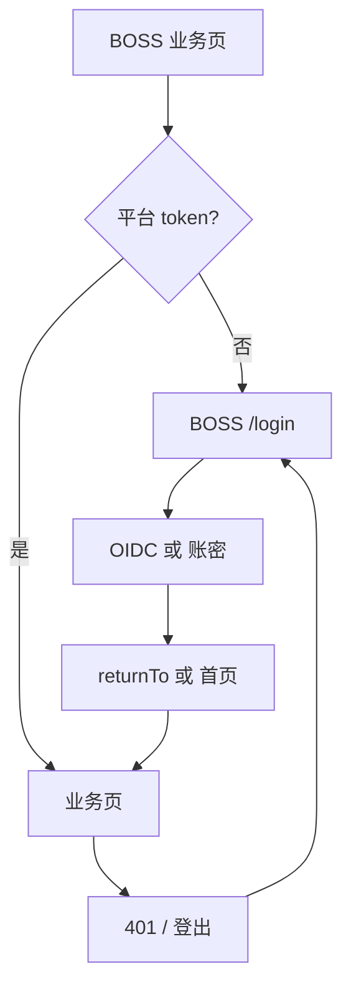

# UX: 登录与身份认证（BOSS · 平台运营台）

> Interaction specification derived from: [`prd-console-login-page.md`](../../prd/console/tenant/prd-console-login-page.md) v2.0 § US-014  
> Part of ani-workflow artifact triad — next: `/prd-to-spec`  
> Generated: 2026-07-03 | Product: **BOSS** | UI stack: **TDesign React + TanStack Router**（P1 规划）  
> Module main doc: **待新建** `repo/services/docs/boss-modules/settings/login-page.md`

**范围：** BOSS 平台管理员登录 UI；与 Console **会话存储隔离**；不含 Core platform API 实现细节。

---

## 1. Page Type

### 1.1 Classification

| Screen | Page type | In app shell? | Route（规划） | 阶段 |
|--------|-----------|---------------|---------------|------|
| 平台登录页 | auth（standalone） | 否 | `/login` | P1 |
| OIDC 回调 | auth（transient） | 否 | `/auth/callback` | P1 |
| BOSS 主应用 | app shell + content | 是 | BOSS 业务树（如 `/`、`/ops/*`） | P1 |

### 1.2 Pattern Reference

| 本页 | 对齐 |
|------|------|
| 视觉 | Console Plain `.auth-page` + `.auth-card`（同 Token、同 400px 宽） |
| 差异 | 标题「ANI 平台运营台」；**无租户标识**字段 |
| 壳层 | BOSS App Shell（与 Console 规范一致，侧栏分组见 `boss-modules`） |

---

## 2. Information Architecture

### 2.1 Routes & Entry Points

| Route | Entry | Auth required |
|-------|-------|---------------|
| `/login` | 未登录访问 BOSS 业务页重定向 | 否 |
| `/auth/callback` | 平台 IdP 回调 | 否 |
| BOSS 业务路由 | 侧栏、书签、`returnTo` | 是（平台 token） |

### 2.2 Navigation Relationship

```text
[未登录]
  BOSS 业务 URL → 保存 returnTo（BOSS 专用 key）→ /login
  /login → 平台 OIDC 或 账密 → returnTo 或 BOSS 首页

[已登录]
  /login → returnTo 或 BOSS 首页
  Header「退出登录」→ /login

[与 Console 关系]
  同浏览器可同时打开 Console 与 BOSS 标签页；
  会话 storage key 必须不同，避免租户 token 与平台 token 互串
```

**页内 Alert（可选 P1）：** info「本入口仅供平台管理员。租户用户请使用 Console。」

### 2.3 PRD Coverage Map

| PRD item | Screen / section |
|----------|------------------|
| US-014 | 全文 |
| US-015 | §5 API 消费（平台路径 SPEC 冻结） |
| FR-8 | §8.2 存储隔离 |
| §10.3 分工 | §2.2 Console 对照 |

---

## 3. User Flow

### 3.1 平台管理员 — OIDC（P1）

```text
1. 打开 BOSS /login
2. Tab「企业登录」：可选勾选「记住我」；点击「登录」
3. POST 平台 OIDC begin（路径 SPEC 冻结，无 tenant_name）
4. 跳转 IdP → 平台账号密码（站外）
5. /auth/callback → 换平台 token → returnTo 或 BOSS 首页
```

### 3.2 平台管理员 — 账密（P1）

```text
1. Tab「账号密码」：username + password + 记住我
2. POST 平台账密 API
3. 200 → returnTo 或 BOSS 首页；失败 Message.error
```

### 3.3 Flow Diagram



---

## 4. Layout Regions

### 4.1 BOSS `/login`

```text
┌─────────────────────────────────────────────┐
│        .auth-page 全屏居中                   │
│   ┌─────────────────────────────────┐       │
│   │  Card.auth-card  max-width 400px │       │
│   │  [Title] ANI 平台运营台          │       │
│   │  [Alert] info 租户请用 Console   │  可选 │
│   │  [Tabs] 企业登录 | 账号密码      │       │
│   │  [Form] 用户名 / 密码            │  账密 Tab │
│   │  ☐ 记住我                       │       │
│   │  [Button] 登录 primary block    │       │
│   │  [Desc] IdP 说明                │  OIDC Tab │
│   └─────────────────────────────────┘       │
└─────────────────────────────────────────────┘
```

| Region | Content | vs Console |
|--------|---------|----------|
| 标题 | **ANI 平台运营台** | 非 KuberCloud ANI 租户文案 |
| 租户标识 | **无** | Console 必填 |
| Tabs | 企业登录 / 账号密码 | 同结构 |
| 记住我 | 有 | 存储 key 前缀与 Console 不同（SPEC） |
| 开发登录 | **P1 不强制** | 若 DEV 需要由 SPEC 决定是否复用模式 |

### 4.2 `/auth/callback`

与 Console §4.2 相同布局与文案；消费**平台** token 交换 API。

### 4.3 BOSS 已登录壳

| Region | Content |
|--------|---------|
| Header 左 | 「ANI 平台运营台」 |
| Header 右 | 「退出登录」 |
| Aside | BOSS 侧栏（资源池与基础设施等） |
| Content | 业务 Outlet |

---

## 5. Component Mapping

| UI element | TDesign | Props / variant | Data / notes |
|------------|---------|-----------------|--------------|
| 页面容器 | `div.auth-page` | 同 Console | — |
| 卡片 | `Card` | `bordered` `auth-card` | — |
| 范围说明 | `Alert` | `theme="info"` closable | 静态 |
| Tab | `Tabs` | 企业登录 / 账号密码 | P1 默认展示两 Tab |
| 用户名 | `FormItem` + `Input` | 账密 Tab | `username` |
| 密码 | `FormItem` + `Input` | `type="password"` | 不持久化 |
| 记住我 | `Checkbox` | | 平台会话 |
| 登录 | `Button` | `primary` `block` `loading` | 平台 OIDC / 账密 API |
| OIDC 说明 | `p` | secondary | 「将跳转到企业身份提供商完成认证」 |
| 错误 | `MessagePlugin` | error / warning | 同 Console §7.2 映射 |
| Callback | `Loading` / `Card` | 同 Console | |
| 登出 | `Button` | outline | Header |

**API 字段（不 invent 路径）：**

| 动作 | 数据源 |
|------|--------|
| 平台 OIDC begin | `POST /api/v1/auth/platform/oidc/begin` 或 SPEC 冻结等价 |
| 平台账密 | `POST /api/v1/auth/platform/password/login` 或 SPEC 冻结等价 |
| Token 交换 | 平台 callback 对应 token 端点 |

---

## 6. State Design

### 6.1 BOSS `/login`

| State | Trigger | UI behavior | Components |
|-------|---------|-------------|------------|
| idle | 进入 | 展示表单 | Card, Form |
| loading | POST 中 | Button loading；表单 disabled | Button |
| redirecting | OIDC 200 | 「跳转中…」→ assign IdP URL | Button |
| error | 4xx/5xx | `Message.error`；账密失败清空密码 | Message |
| already_authed | 有平台 token | → returnTo 或 BOSS 首页 | redirect |

### 6.2 `/auth/callback`

| State | Trigger | UI behavior |
|-------|---------|-------------|
| loading | 正常回调 | 同 Console |
| error | 缺参/state/token 失败 | 同 Console 文案 |
| success | 200 | returnTo 或 BOSS 首页（SPEC 默认 `/` 或 `/ops/overview`） |

### 6.3 全局

| State | Trigger | UI behavior |
|-------|---------|-------------|
| gate_redirect | 无平台 token | → BOSS `/login` |
| session_expired_401 | API 401 | warning + returnTo + `/login` |
| logout | 点击退出 | 清**平台** storage → `/login` |

### 6.4 Empty states

不适用。

---

## 7. Copy & Feedback

### 7.1 Labels & Buttons

| Element | Copy (zh-CN) |
|---------|--------------|
| 页面标题 | ANI 平台运营台 |
| 范围 Alert | 本入口仅供平台管理员。租户用户请使用 Console 登录。 |
| Tab | 企业登录 / 账号密码 |
| 记住我 | 记住我 |
| 主 CTA | 登录 / 跳转中… |
| OIDC 说明 | 将跳转到企业身份提供商完成认证 |
| 登出 | 退出登录 |

### 7.2 Messages

| Scenario | Type | Copy |
|----------|------|------|
| INVALID_CREDENTIALS | `Message.error` | 用户名或密码错误 |
| IDP_UNAVAILABLE | `Message.error` | 身份服务暂不可用，请稍后重试 |
| 401 全局 | `Message.warning` | 登录已过期，请重新登录 |
| callback 错误 | 错误卡 | 与 Console UX §7.2 相同 |

---

## 8. Boundaries & Non-Goals

### 8.1 In Scope (UX)

- P1 平台 Plain 登录页 + 双 Tab
- returnTo、记住我、401、登出（模式同 Console）
- 与 Console 视觉一致、文案与字段区分

### 8.2 Explicitly Out of Scope (UI)

- 租户标识输入（Console 专属）
- gamified 动画
- 租户排行、GPU 等业务页
- 与 Console 共用 auth storage key
- P0 不交付（BOSS 前端骨架待落地）

### 8.3 Open UX Questions

- BOSS 默认首页路径：`/` vs `/ops/overview` — **SPEC 冻结**
- 平台 OIDC `redirect_uri` 是否与 Console 共用 `/auth/callback` — **SPEC 定**（若同域需防 state/key 冲突）

### 8.4 Assumptions

- BOSS 首期与 Console 共用 TDesign Token 与 `.auth-page` 样式类
- `repo/frontends/boss/` 尚未存在；UX 供 P1 实现与 SPEC 路由注册
- 平台 token 与租户 token **永不**写入同一 storage key

---

## Document Links

| Artifact | Path |
|----------|------|
| PRD v2 | `repo/services/tasks/modules/prd/console/tenant/prd-console-login-page.md` |
| Console UX | `repo/services/tasks/modules/ux/console/tenant/ux-console-login-page.md` |
| UX（本文） | `repo/services/tasks/modules/ux/boss/settings/ux-boss-login-page.md` |
