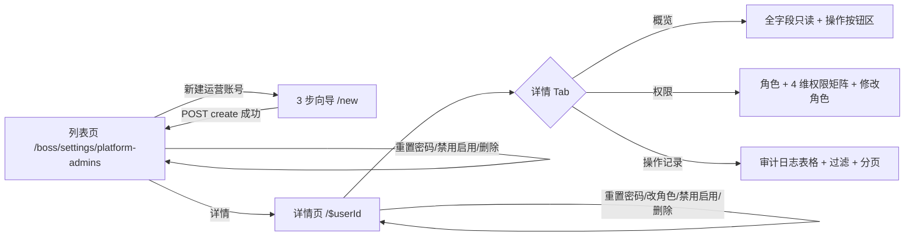

# UX: 平台运营账号管理

> Interaction specification derived from: [PRD: 平台账户管理 (new)](../../prd/boss/settings/prd-new-boss-platform-admin.md)
> 产品方案：`repo/产品原型-7.23/boss-platform-admins-提案.md`（方案 C · 已拍板）
> 产品原型：`repo/产品原型-7.23/index.html`（`/boss/settings/platform-admins` 页）+ `store.js` 种子数据
> Part of ani-workflow artifact triad — next: `/prd-to-spec`
> Generated: 2026-08-18 | Product: BOSS | UI stack: TDesign React + TanStack Router + TanStack Query

---

## 1. Page Type

### 1.1 Classification

| Screen | Page type | In app shell? | Route |
|--------|----------|---------------|-------|
| 平台运营账号列表（主页） | list | yes | `/boss/settings/platform-admins` |
| 新建运营账号 | wizard（3 步，独立路由） | yes | `/boss/settings/platform-admins/new` |
| 账号详情 | detail（独立路由 + Tabs） | yes | `/boss/settings/platform-admins/$userId` |
| 修改角色 | dialog（in-detail 权限 Tab） | yes | 详情页「权限」Tab 内 Dialog 浮层 |
| 重置密码 | dialog（in-list / in-detail） | yes | 列表行 / 详情页 Dialog 浮层 |
| 禁用 / 启用 / 删除 | inline action + Popconfirm | yes | 列表行 / 详情页操作区 |

### 1.2 Pattern Reference

| 本页 | 对齐 |
|------|------|
| 列表 | 复用「配额策略」列表 `src/routes/_authenticated/tenants/quotas/index.tsx`（Toolbar + Table + cursor 分页 + Empty/Alert） |
| 新建向导 | 复用 `src/components/tenant-plans/CreatePlanWizard.tsx`（Steps + 逐步表单 + 确认摘要 + 底部上一步/下一步） |
| 详情独立页 | 复用 `src/routes/_authenticated/tenants/quotas.$planId.tsx` + `PlanDetailPage.tsx`（返回按钮 + Tabs + 操作按钮区） |
| 修改角色 Dialog | 复用 `EditPlanInfoDialog.tsx`（Dialog + Form + footer 确认/取消） |
| 操作记录 Tab | 复用 `AuditLogsTab.tsx`（Select 过滤 + Table + cursor 分页 + Empty/Alert） |
| 权限控制 | 复用 `src/auth/permissions.ts`，新增 `canManagePlatformAdmins()`（仅 platform-admin） |

---

## 2. Information Architecture

### 2.1 Routes & Entry Points

| Route | Entry (nav / deep link / redirect) | Auth required |
|-------|-------------------------------------|---------------|
| `/boss/settings/platform-admins` | 侧栏「平台设置 → 平台运营账号」 | yes（仅 platform-admin） |
| `/boss/settings/platform-admins/new` | 列表页「新建运营账号」按钮 | yes（仅 platform-admin） |
| `/boss/settings/platform-admins/$userId` | 列表行「详情」 | yes（仅 platform-admin） |

### 2.2 Navigation Relationship

```text
侧栏菜单
└── 平台设置（SubMenu）                       ← 需将现有单层 MenuItem 改为 SubMenu
    ├── 平台运营账号    /boss/settings/platform-admins   P0  ← 本页面
    ├── 登录与 IdP（预留）  /boss/settings/idp             P1
    └── 会话与安全策略（预留） /boss/settings/session       P2
```

当前 `_authenticated.tsx` 中「平台设置」为单层 `Menu.MenuItem` 指向 `/`，需改为 `Menu.SubMenu` 并新增「平台运营账号」子项。

**与「租户管理员」严格分离**（文案禁止混用）：

| | 平台运营账号 | 租户管理员 |
|---|---|---|
| 菜单域 | 平台设置 | 租户管理 |
| 登录入口 | BOSS `/login`（无租户字段） | Console `/login`（须带租户） |
| 作用范围 | 全平台运营 | 单一客户租户内 |
| 列表字段 | 用户名、角色、状态、来源、最近登录（**无租户列**） | 用户、邮箱、所属租户、角色… |

### 2.3 PRD Coverage Map

| PRD item | Screen / section |
|----------|------------------|
| US-001 创建平台账号 | §3.1 主流程-创建；§4.2 新建向导；§5.2；§6.2 |
| US-002 查询平台账号列表 | §3.1 主流程-查看；§4.1 列表；§5.1；§6.1 |
| US-003 查询平台账号详情 | §3.1 主流程-详情；§4.3 详情-概览 Tab；§5.3；§6.3 |
| US-004 修改平台账号角色 | §3.2 改角色；§4.3 详情-权限 Tab；§5.3；§6.4 |
| US-005 重置平台账号密码 | §3.2 重置密码；§4.4；§5.4；§6.5 |
| US-006 禁用/启用/删除 | §3.2 禁用启用删除；§4.4；§5.4；§6.6 |
| US-007 查询可变更角色与权限矩阵 | §3.1 创建-角色选择；§4.3 权限 Tab；§5.2/5.3 |
| US-008 查询操作历史 | §3.1 详情-操作记录 Tab；§4.3；§5.3；§6.3 |

---

## 3. User Flow

### 3.1 Primary Flow

```text
查看平台运营账号列表
  platform-admin 进入 /boss/settings/platform-admins
  → 系统加载（GET /api/v1/svc/platform-admins?limit=20；翻页携带 cursor）
  → 展示表格：用户名 / 显示名 / 角色 / 状态 / 来源 / 最近登录 / 操作
  → 顶部支持 关键字 / 状态(active|disabled) / 角色 / 来源 过滤

创建平台运营账号
  用户点击「新建运营账号」→ 跳转 /boss/settings/platform-admins/new
  → Step1 填写 用户名 + 显示名 + 邮箱
  → Step2 选择 角色（下拉来自 GET /roles，附权限矩阵预览）+ 填写 初始密码（复杂度校验）
  → Step3 确认摘要 → POST /api/v1/svc/platform-admins（body 含 idempotency_key）
  → 成功：Message.success「平台运营账号已创建」+ 跳转回列表
  → 失败：按错误码提示（见 §7.2）

查看账号详情
  用户点击某行「详情」→ 跳转 /boss/settings/platform-admins/$userId
  → 系统并行加载详情（GET .../platform-admins/{userId}）+ 权限（GET .../roles 当前角色匹配项）
  → 默认「概览」Tab 展示全字段（id/email/username/display_name/role/status/source/last_login_at/created_at）
  → 顶部操作区：重置密码 / 禁用|启用 / 删除
  → 「权限」Tab：展示角色 + 4 维权限矩阵 + 修改角色
  → 「操作记录」Tab：审计日志表格 + action/result 过滤 + 分页
```

### 3.2 Secondary Flows

```text
修改角色（详情页「权限」Tab）
  用户点击「修改角色」→ 弹出 Dialog
  → Select 选择新角色（platform-admin / platform-ops / platform-readonly，来自 GET /roles）
  → 选中后预览该角色的 4 维权限矩阵
  → 确认 → PUT /api/v1/svc/platform-admins/{userId}/role（body 含 idempotency_key）
  → 成功：关闭 Dialog + Message.success「角色已修改」+ 刷新详情与权限
  → 422 LAST_PLATFORM_ADMIN：Message.error「至少保留一名活跃的平台超级管理员」
  → 422 ROLE_CHANGE_INVALID：Message.error「角色不在允许范围」

重置密码（列表行 / 详情页）
  用户点击「重置密码」→ 弹出 Dialog：输入新密码（8-64 字符，四类至少三类）
  → 确认 → POST /api/v1/svc/platform-admins/{userId}/reset-password（body 含 new_password + idempotency_key）
  → 成功：关闭 Dialog + Message.success「密码已重置」+ 刷新
  → 422 PASSWORD_SAME_AS_OLD：内联错误「新密码不能与旧密码相同」
  → 400 VALIDATION_FAILED：Message.error「密码不满足复杂度要求」

禁用 / 启用（列表行 / 详情页）
  用户对某行「禁用」/「启用」→ Popconfirm 确认
  → POST .../disable | .../enable（body 含 idempotency_key）
  → 成功：Message.success「已禁用 / 已启用」+ 刷新
  → 422 LAST_PLATFORM_ADMIN：Message.error「至少保留一名活跃的平台超级管理员」

删除（列表行「更多」/ 详情页）
  用户点击「删除」→ Popconfirm danger 确认
  → DELETE /api/v1/svc/platform-admins/{userId}（body 含 idempotency_key）
  → 成功：Message.success「已删除」+ 跳转回列表
  → 422 LAST_PLATFORM_ADMIN：Message.error「至少保留一名活跃的平台超级管理员」

返回列表
  详情页顶部「返回平台运营账号」按钮 → navigate /boss/settings/platform-admins
```

### 3.3 Flow Diagram



---

## 4. Layout Regions

### 4.1 平台运营账号列表页

```text
┌──────────────────────────────────────────────────────────────┐
│ [Page Header: 标题「平台运营账号」 + 副标题 + 新建运营账号按钮]  │
├──────────────────────────────────────────────────────────────┤
│ [Toolbar: 关键字搜索 | 状态筛选 | 角色筛选 | 来源筛选]        │
├──────────────────────────────────────────────────────────────┤
│ [Table: 用户名 | 显示名 | 角色 | 状态 | 来源 | 最近登录 | 操作]│
│  ┌─ 行操作：详情 | 重置密码 | 改角色 | 禁用/启用              │
│  └─ 更多：删除                                                │
├──────────────────────────────────────────────────────────────┤
│ [分页：上一页 | 下一页，由 next_cursor 驱动]                  │
└──────────────────────────────────────────────────────────────┘
```

| Screen | Region | Content | Notes |
|--------|--------|---------|-------|
| 列表 | page header | 标题「平台运营账号」+ 副标题「管理可登录 BOSS 的平台运营账号，与租户管理员严格分离」+ 主操作「新建运营账号」按钮 | 仅 platform-admin 可见 |
| 列表 | toolbar | `Input` 关键字（email/username 模糊）+ `Select` 状态（active/disabled）+ `Select` 角色（platform-admin/ops/readonly）+ `Select` 来源（本地/第三方）+ 搜索/重置按钮 | 来源「第三方」对应 oidc 前缀；P0 仅存在本地账号 |
| 列表 | table | 列：用户名(username) / 显示名(display_name) / 角色(Tag) / 状态(Tag) / 来源 / 最近登录 / 操作 | 列来源对齐 `GET /platform-admins` items 字段；**无 email 列**（email 仅详情返回）；**无 MFA 列**（PRD 未定义） |
| 列表 | 操作列 | 「详情」常驻 +「重置密码」+「改角色」+ 禁用→「禁用」/ disabled→「启用」；「更多」下拉含「删除」 | 4 个直接行操作 + 1 个下拉项 |
| 列表 | pagination | `Pagination` 上一页/下一页，由 next_cursor 驱动 | limit 默认 20 |

### 4.2 新建运营账号向导（独立路由）

```text
┌─────────────────────────────────────────────────────┐
│ [返回平台运营账号]                                   │
│ [Page Header: 新建运营账号]                          │
│ [Steps: 1 用户名与邮箱 → 2 角色与初始密码 → 3 确认创建]│
├─────────────────────────────────────────────────────┤
│ Step 1: 用户名* / 显示名* / 邮箱*                     │
│ Step 2: 角色*（Select + 权限矩阵预览） / 初始密码*    │
│ Step 3: 确认摘要（只读回显全部字段）                  │
├─────────────────────────────────────────────────────┤
│ [Footer: 取消/上一步 | 下一步/确认创建]               │
└─────────────────────────────────────────────────────┘
```

| Screen | Region | Content | Notes |
|--------|--------|---------|-------|
| 向导 | header | 标题「新建运营账号」+ Steps 三步指示 | 复用 `Steps` 组件 |
| 向导 Step1 | form | `Form layout="vertical"`：username（Input, 1-64 字符, 全局唯一）+ display_name（Input, 1-128 字符）+ email（Input, RFC 5322, 全局唯一） | username 不含 `:` 前缀；提示「用于 BOSS 账密登录，无租户字段」 |
| 向导 Step2 | form | role（Select, options 来自 `GET /roles`）+ 选中角色后下方展示 4 维权限矩阵预览（只读）+ password（Input.Password, 8-64 字符，四类至少三类）+ 密码复杂度实时提示 | 角色下拉项含 platform-admin / platform-ops / platform-readonly |
| 向导 Step3 | confirm | 只读回显：用户名 / 显示名 / 邮箱 / 角色 / 权限矩阵摘要 / 「创建后状态为活跃，可立即 BOSS 账密登录」 | 提示文案 |
| 向导 | footer | Step1：取消 + 下一步；Step2：上一步 + 下一步；Step3：上一步 + 确认创建（loading） | 提交 POST create（body 含 idempotency_key） |

### 4.3 账号详情页（独立路由 + Tabs）

```text
┌──────────────────────────────────────────────────────┐
│ [返回平台运营账号]                                    │
│ [Page Header: 平台运营账号详情 - {username}]           │
│ [操作区: 重置密码 | 禁用/启用 | 删除]                  │
├──────────────────────────────────────────────────────┤
│ [Tabs: 概览 | 权限 | 操作记录]                        │
│                                                       │
│ [概览 Tab]                                            │
│  id / email / username / display_name                 │
│  角色(Tag) / 状态(Tag) / 来源                         │
│  最近登录 / 创建时间                                   │
│                                                       │
│ [权限 Tab]                                            │
│  当前角色(Tag) + 4 维权限矩阵(只读)   [修改角色]      │
│                                                       │
│ [操作记录 Tab]                                       │
│  [筛选: action | result]                             │
│  [Table: action | resource | result | details | 时间]│
│  [分页: 上一页 | 下一页]                              │
└──────────────────────────────────────────────────────┘
```

| Screen | Region | Content | Notes |
|--------|--------|---------|-------|
| 详情 | header | 「返回平台运营账号」文字按钮 + 标题「平台运营账号详情 - {username}」 | 复用 `ChevronLeftSIcon` |
| 详情 | 操作区 | `Button` 重置密码（outline）+ 禁用→`Button` 禁用（outline + Popconfirm）/ disabled→`Button` 启用（outline + Popconfirm）+ `Button` 删除（danger + Popconfirm） | 写操作按钮区；disabled 账号行操作按状态隐藏 |
| 详情 | 概览 Tab | `grid` 只读展示：id / email / username / display_name / 角色(Tag) / 状态(Tag) / 来源 / 最近登录 / 创建时间 | 数据来自 `GET .../platform-admins/{userId}` |
| 详情 | 权限 Tab | 当前角色 `Tag` + 4 维权限矩阵（`Table` 或 `Descriptions`：tenant_ops / resource_pool / platform_user / audit_export → read/write/none）+「修改角色」按钮 | 数据来自 `GET .../roles`（前端按当前 role 匹配） |
| 详情 | 操作记录 Tab | `Select` action 过滤 + `Select` result 过滤 + `Table`（action/resource/result(Tag)/details/created_at）+ `Pagination` | 数据来自 `GET .../platform-admins/{userId}/audit-logs` |

### 4.4 修改角色 / 重置密码 / 禁用启用删除（浮层与行操作）

```text
修改角色 Dialog:
┌─────────────────────────────────────┐
│ [Dialog: 修改角色]                  │
│  当前角色：平台运维（Tag 只读）      │
│  新角色 [Select]                    │
│  选中角色权限预览（4 维矩阵只读）    │
│  [Footer: 取消 | 保存]              │
└─────────────────────────────────────┘

重置密码 Dialog:
┌─────────────────────────────────────┐
│ [Dialog: 重置密码 - {username}]     │
│  新密码 [Input.Password] *          │
│  确认新密码 [Input.Password] *      │
│  提示：8-64 字符，四类至少三类       │
│  [Footer: 取消 | 确认重置]          │
└─────────────────────────────────────┘
```

| Screen | Region | Content | Notes |
|--------|--------|---------|-------|
| 修改角色 Dialog | form | 当前角色（只读 Tag）+ 新角色 Select（来自 `GET /roles`）+ 选中后权限矩阵预览 | 提交 PUT role（body 含 idempotency_key） |
| 重置密码 Dialog | form | 新密码 + 确认新密码（Input.Password，8-64 字符，四类至少三类） | 提交 POST reset-password（body 含 new_password + idempotency_key） |
| 禁用/启用 | Popconfirm | 确认文案 | POST disable/enable（body 含 idempotency_key） |
| 删除 | Popconfirm | danger 确认文案 | DELETE（body 含 idempotency_key） |

---

## 5. Component Mapping

### 5.1 平台运营账号列表

| UI element | TDesign component | Props / variant | Data source |
|------------|-------------------|-----------------|-------------|
| 新建运营账号按钮 | `Button` | `theme="primary"`, `icon={<AddIcon />}` | — |
| 关键字搜索 | `Input` | `placeholder="搜索邮箱或用户名"`, `clearable`, prefix `SearchIcon` | user input |
| 状态筛选 | `Select` | `clearable`, options: active/disabled | user select |
| 角色筛选 | `Select` | `clearable`, options: platform-admin/platform-ops/platform-readonly | user select |
| 来源筛选 | `Select` | `clearable`, options: 本地(local)/第三方(oidc) | user select |
| 搜索/重置 | `Button` | 搜索 `theme="primary"` / 重置 `variant="outline"` | — |
| 账号表格 | `Table` | `rowKey="id"`, `loading`, `bordered` | API `GET /platform-admins` |
| 用户名列 | text | username | row.username |
| 显示名列 | text | display_name | row.display_name |
| 角色列 | `Tag` | platform-admin→primary / platform-ops→success / platform-readonly→default | row.role |
| 状态列 | `Tag` | active→success「活跃」/ disabled→default「已禁用」 | row.status |
| 来源列 | text | local→「本地」/ third_party→「第三方」 | row.source |
| 最近登录列 | text | formatDateTime(last_login_at) | row.last_login_at |
| 行操作-详情 | `Button` | `variant="text"` | — |
| 行操作-重置密码 | `Button` | `variant="text"`, 触发 Dialog | — |
| 行操作-改角色 | `Button` | `variant="text"`, 触发 Dialog | — |
| 行操作-禁用 | `Button` + `Popconfirm` | `variant="text"`, 仅 active 显示 | row.status |
| 行操作-启用 | `Button` + `Popconfirm` | `variant="text"`, 仅 disabled 显示 | row.status |
| 行操作-更多 | `Dropdown` | 含「删除」 | — |
| 更多-删除 | `Button` + `Popconfirm` | `theme="danger"` | — |
| 分页 | `Pagination` | 上一页/下一页，由 next_cursor 驱动 | API limit/cursor + next_cursor |

### 5.2 新建运营账号向导

| UI element | TDesign component | Props / variant | Data source |
|------------|-------------------|-----------------|-------------|
| 步骤指示 | `Steps` | 3 步：用户名与邮箱 / 角色与初始密码 / 确认创建 | — |
| Step1 表单 | `Form` | `layout="vertical"`, `form`, `resetType="empty"` | — |
| 用户名 | `Form.FormItem` + `Input` | `name="username"`, required, 1-64 字符, 不含 `:` | user input |
| 显示名 | `Form.FormItem` + `Input` | `name="display_name"`, required, 1-128 字符 | user input |
| 邮箱 | `Form.FormItem` + `Input` | `name="email"`, required, type email（RFC 5322） | user input |
| Step2 表单 | `Form` | `layout="vertical"` | — |
| 角色 | `Form.FormItem` + `Select` | `name="role"`, options 来自 `GET /roles`（platform-admin/ops/readonly） | API roles |
| 权限矩阵预览 | `Table` 或 `Descriptions` | 4 维：tenant_ops/resource_pool/platform_user/audit_export → read/write/none，只读 | 选中角色匹配 |
| 初始密码 | `Form.FormItem` + `Input.Password` | `name="password"`, required, 8-64 字符，四类至少三类 | user input |
| 密码复杂度提示 | `Alert` | `theme="info"` 实时校验提示 | — |
| Step3 确认摘要 | 只读 `Descriptions` / text | 回显 username/display_name/email/role + 权限摘要 + 提示「创建后状态为活跃」 | draft |
| Footer 取消 | `Button` | `variant="outline"` | — |
| Footer 上一步 | `Button` | `variant="outline"` | — |
| Footer 下一步 | `Button` | `theme="primary"` | — |
| Footer 确认创建 | `Button` | `theme="primary"`, `loading={submitting}` | 提交 POST create |

### 5.3 账号详情页

| UI element | TDesign component | Props / variant | Data source |
|------------|-------------------|-----------------|-------------|
| 返回按钮 | `Button` | `variant="text"`, `icon={<ChevronLeftSIcon />}` | — |
| 操作区-重置密码 | `Button` | `variant="outline"`, 触发 Dialog | — |
| 操作区-禁用 | `Button` + `Popconfirm` | `variant="outline"`, 仅 active 显示 | — |
| 操作区-启用 | `Button` + `Popconfirm` | `variant="outline"`, 仅 disabled 显示 | — |
| 操作区-删除 | `Button` + `Popconfirm` | `theme="danger"` | — |
| Tabs | `Tabs` | 3 个 TabPanel: overview / permissions / audit-logs | — |
| 概览字段 | `grid`（label-value 两列） | 只读展示全字段 | `GET .../platform-admins/{userId}` |
| 角色 Tag | `Tag` | 同列表角色映射 | row.role |
| 状态 Tag | `Tag` | 同列表状态映射 | row.status |
| 权限矩阵 | `Table` 或 `Descriptions` | 4 维权限（只读） | `GET .../roles` 按当前 role 匹配 |
| 修改角色按钮 | `Button` | `theme="primary"`, 触发 Dialog | — |
| 修改角色 Dialog | `Dialog` + `Form` + `Select` | options 来自 `GET /roles`；选中后权限矩阵预览 | API roles |
| 历史筛选-action | `Select` | `clearable`, options: create/change_role/reset_password/disable/enable/delete | — |
| 历史筛选-result | `Select` | `clearable`, options: success/failed | — |
| 历史表格 | `Table` | columns: action/resource/result(Tag)/details/created_at, `rowKey="id"` | `GET .../audit-logs` |
| 历史分页 | `Pagination` | 上一页/下一页，由 next_cursor 驱动 | API limit/cursor + next_cursor |

### 5.4 重置密码 / 禁用启用删除

| UI element | TDesign component | Props / variant | Data source |
|------------|-------------------|-----------------|-------------|
| 重置密码 Dialog | `Dialog` + `Form` + `Input.Password` | 校验 8-64 字符、四类至少三类、两次一致 | user input |
| 禁用 Popconfirm | `Popconfirm` | content「禁用后该账号无法登录 BOSS，确认禁用？」 | — |
| 启用 Popconfirm | `Popconfirm` | content「确认启用该账号？」 | — |
| 删除 Popconfirm | `Popconfirm` | `theme="danger"`, content「删除后该账号将无法登录 BOSS，此操作不可撤销，确认删除？」 | — |

---

## 6. State Design

### 6.1 平台运营账号列表

| State | Trigger | UI behavior | Components |
|-------|---------|-------------|------------|
| idle | 初始加载成功 | 正常展示表格 | Table |
| loading | `useQuery` isLoading | 表格 `loading=true` | Table loading |
| empty | 列表长度 0 且非 loading/error | `Empty`「还没有平台运营账号（安装引导会创建首个超管）」 | Empty |
| error | API 失败 | `Alert theme="error"` + 错误信息 + `Button`「重试」 | Alert |
| error-403 | 非 platform-admin 访问 | `Alert theme="error"`「无平台运营账号管理权限」 | Alert |
| search | 输入搜索关键字 | debounce 300ms 后重新查询，Table loading | Input |
| filter | 切换状态/角色/来源筛选 | 立即重新查询；重置 cursor 栈 | Select |
| page-change | 翻页 | 携带 cursor 重新查询 | Pagination |

### 6.2 新建运营账号向导

| State | Trigger | UI behavior | Components |
|-------|---------|-------------|------------|
| step1 | 进入 / 点击上一步 | 展示用户名/显示名/邮箱表单 | Form |
| step2 | Step1 校验通过 → 下一步 | 展示角色选择 + 密码表单；并行加载 `GET /roles` | Form + Select |
| roles-loading | GET /roles 进行中 | 角色 Select loading；权限矩阵 `Skeleton` | Skeleton |
| roles-error | GET /roles 失败 | `Alert theme="error"` + 重试 | Alert |
| step3 | Step2 校验通过 → 下一步 | 展示确认摘要（只读回显） | — |
| submitting | POST create 进行中 | 「确认创建」按钮 `loading=true`，字段 disabled | Button loading |
| success | POST 200 | `Message.success`「平台运营账号已创建」+ navigate 回列表 | Message |
| error-409 | EMAIL_ALREADY_EXISTS | `Message.error`「邮箱已被占用」 | Message |
| error-409 | USERNAME_ALREADY_EXISTS | `Message.error`「用户名已被占用」 | Message |
| error-400 | VALIDATION_FAILED | `Message.error`「校验失败：{message}」 | Message |
| cancel | 点击取消 | navigate 回列表 | — |

### 6.3 账号详情页

| State | Trigger | UI behavior | Components |
|-------|---------|-------------|------------|
| loading | 打开时加载详情 | `Skeleton` 占位 | Skeleton |
| loaded | 详情加载成功 | 展示概览 Tab 默认 | — |
| error | 加载失败 | `Alert theme="error"` + 重试 + 返回 | Alert |
| not-found | 404 | `Alert theme="warning"`「账号不存在或已删除」+ 返回 | Alert |
| permission-loading | 切到权限 Tab | 权限矩阵 loading | — |
| permission-error | GET /roles 失败 | `Alert theme="error"` + 重试 | Alert |
| audit-loading | 切到操作记录 Tab / 翻页 | Table loading | Table loading |
| audit-empty | 无历史记录 | `Empty`「暂无操作记录」 | Empty |
| audit-error | GET audit-logs 失败 | `Alert theme="error"` + 重试 | Alert |

### 6.4 修改角色（权限 Tab）

| State | Trigger | UI behavior | Components |
|-------|---------|-------------|------------|
| idle | 权限加载成功 | 展示角色 + 4 维权限矩阵 | — |
| dialog-open | 点击「修改角色」 | 弹出角色选择 Dialog | Dialog + Select |
| submitting | PUT .../role 进行中 | 确认按钮 loading | Button loading |
| success | PUT 200 | 关闭 Dialog + `Message.success`「角色已修改」+ 刷新详情与权限 | Message |
| error-422 | LAST_PLATFORM_ADMIN | `Message.error`「至少保留一名活跃的平台超级管理员」 | Message |
| error-422 | ROLE_CHANGE_INVALID | `Message.error`「角色不在允许范围」 | Message |

### 6.5 重置密码

| State | Trigger | UI behavior | Components |
|-------|---------|-------------|------------|
| dialog-open | 点击「重置密码」 | 弹出 Dialog，Form reset | Dialog + Form |
| validating | 字段失焦 / 提交 | `FormItem` rules 校验，错误内联 | Form |
| submitting | POST reset 进行中 | 确认按钮 loading | Button loading |
| success | POST 200 | 关闭 Dialog + `Message.success`「密码已重置」+ 刷新 | Message |
| error-422 | PASSWORD_SAME_AS_OLD | 内联 `FormItem` 错误「新密码不能与旧密码相同」 | inline |
| error-400 | VALIDATION_FAILED | `Message.error`「密码不满足复杂度要求（8-64 字符、四类至少三类）」 | Message |

### 6.6 禁用 / 启用 / 删除

| State | Trigger | UI behavior | Components |
|-------|---------|-------------|------------|
| disabling | POST disable 进行中 | 按钮 loading + Popconfirm 关闭 | — |
| disable-success | 200 | `Message.success`「已禁用」+ 刷新 | Message |
| enabling | POST enable 进行中 | 按钮 loading | — |
| enable-success | 200 | `Message.success`「已启用」+ 刷新 | Message |
| deleting | DELETE 进行中 | 按钮 loading + Popconfirm 关闭 | — |
| delete-success | 200（软删除） | `Message.success`「已删除」+ 跳转回列表 | Message |
| last-admin | 422 LAST_PLATFORM_ADMIN | `Message.error`「至少保留一名活跃的平台超级管理员」 | Message |

---

## 7. Copy & Feedback

### 7.1 Labels & Buttons

| Element | Copy (zh-CN) | Notes |
|---------|--------------|-------|
| 侧栏菜单 | 平台设置 / 平台运营账号 | 二级菜单 |
| 页面标题 | 平台运营账号 | 列表页 + 侧栏 |
| 页面副标题 | 管理可登录 BOSS 的平台运营账号，与租户管理员严格分离 | — |
| 新建按钮 | 新建运营账号 | — |
| 搜索 placeholder | 搜索邮箱或用户名 | — |
| 状态选项 | 全部 / 活跃 / 已禁用 | Select options（PRD status 仅 active/disabled，无 invited） |
| 角色选项 | 全部 / 平台超级管理员 / 平台运维 / 平台只读 | Select options |
| 来源选项 | 全部 / 本地 / 第三方 | Select options |
| 表格列 | 用户名 / 显示名 / 角色 / 状态 / 来源 / 最近登录 / 操作 | — |
| 角色 Tag | 平台超级管理员 / 平台运维 / 平台只读 | platform-admin→primary / ops→success / readonly→default |
| 状态 Tag | 活跃 / 已禁用 | active→success / disabled→default |
| 来源 | 本地 / 第三方 | local→本地 / third_party→第三方 |
| 行操作 | 详情 / 重置密码 / 改角色 / 禁用 / 启用 / 更多 | 列表行内 |
| 更多操作 | 删除 | Dropdown |
| 向导标题 | 新建运营账号 | — |
| 向导步骤 | 用户名与邮箱 / 角色与初始密码 / 确认创建 | Steps |
| 向导字段 | 用户名 / 显示名 / 邮箱 / 角色 / 初始密码 | — |
| 向导提示 | 用户名用于 BOSS 账密登录，无租户字段。≠ 租户管理员。 | Step1 提示 |
| 向导密码提示 | 8-64 字符，至少包含大写字母、小写字母、数字、特殊字符中的三类 | Step2 |
| 向导确认提示 | 创建后状态为活跃，可立即使用 BOSS 账密登录（无租户字段） | Step3 |
| 向导按钮 | 取消 / 上一步 / 下一步 / 确认创建 | — |
| 详情标题 | 平台运营账号详情 - {username} | — |
| 详情返回 | 返回平台运营账号 | — |
| 详情 Tabs | 概览 / 权限 / 操作记录 | — |
| 权限矩阵维度 | 租户开通与冻结 / 平台资源池 / 平台运营账号 / 审计导出 | tenant_ops / resource_pool / platform_user / audit_export |
| 权限值 | 读 / 写 / 无 | read / write / none |
| 修改角色 | 修改角色 | — |
| 重置密码 Dialog 标题 | 重置密码 - {username} | — |
| 重置密码字段 | 新密码 / 确认新密码 | — |
| 重置密码按钮 | 取消 / 确认重置 | — |
| 禁用 Popconfirm | 禁用后该账号无法登录 BOSS，确认禁用？ | — |
| 启用 Popconfirm | 确认启用该账号？ | — |
| 删除 Popconfirm | 删除后该账号将无法登录 BOSS，此操作不可撤销，确认删除？ | danger |

### 7.2 Messages

| Scenario | Type | Copy |
|----------|------|------|
| 创建成功 | `Message.success` | 平台运营账号已创建 |
| 创建失败-409 EMAIL | `Message.error` | 邮箱已被占用 |
| 创建失败-409 USERNAME | `Message.error` | 用户名已被占用 |
| 创建失败-400 | `Message.error` | 校验失败：{message} |
| 改角色成功 | `Message.success` | 角色已修改 |
| 改角色失败-422 LAST_ADMIN | `Message.error` | 至少保留一名活跃的平台超级管理员 |
| 改角色失败-422 INVALID | `Message.error` | 角色不在允许范围 |
| 重置成功 | `Message.success` | 密码已重置 |
| 重置失败-422 SAME_AS_OLD | 内联 `FormItem` 错误 | 新密码不能与旧密码相同 |
| 重置失败-400 | `Message.error` | 密码不满足复杂度要求（8-64 字符、四类至少三类） |
| 禁用成功 | `Message.success` | 已禁用 |
| 启用成功 | `Message.success` | 已启用 |
| 删除成功 | `Message.success` | 已删除 |
| 禁用/删除-422 LAST_ADMIN | `Message.error` | 至少保留一名活跃的平台超级管理员 |
| 网络错误 | `Message.error` | 网络异常，请稍后重试 |

---

## 8. Boundaries & Non-Goals

### 8.1 In Scope (UX)

- 平台运营账号列表页 `/boss/settings/platform-admins`（关键字 / 状态 / 角色 / 来源 筛选 + cursor 分页）
- 新建运营账号 3 步向导（用户名与邮箱 → 角色与初始密码 → 确认创建），直接创建并设密码（不邀请）
- 账号详情独立页（概览 / 权限 / 操作记录 三个 Tab）
- 角色与 4 维权限矩阵查询（tenant_ops / resource_pool / platform_user / audit_export → read/write/none）
- 修改角色（PUT role，先删旧角色再插新角色）
- 重置密码（复杂度校验 + 与旧密码不同）
- 禁用 / 启用 / 软删除（删除/禁用前最后管理员保护）
- 操作历史查询（action/result 过滤 + 分页）
- 状态徽标映射（active/disabled；角色 Tag）
- 权限控制：仅 platform-admin 可写（platform-ops/readonly 不可管理平台运营账号）

### 8.2 Explicitly Out of Scope

- **邮件邀请注册** — PRD Non-Goal 明确「不支持平台账号邮件邀请注册（仅由 platform-admin 直接创建）」；不实现邀请、设密链接、邀请中状态、重发邀请、模拟设密（原型中的「邀请中」「模拟设密」为演示用，不纳入 UX）
- **修改用户名** — PRD Non-Goal 明确「不支持修改用户名」；修改角色 Dialog 不含用户名字段
- **平台账号 SSO/OIDC 集成** — PRD Non-Goal；来源列保留「第三方」展示位但 P0 仅存在本地账号
- **新建 platform_admins 表** — 后端复用 users 表（tenant_id IS NULL），前端不感知表结构
- **MFA 状态列** — PRD 未定义 MFA 字段，列表与详情均不展示 MFA（与租户管理员 UX 不同）
- **email 列** — 列表 items 不含 email（仅详情返回），列表不展示 email 列
- **导出** — 原型「导出」次级操作，PRD/plan 未定义导出接口，不纳入
- **运维演示能力** — 原型「模拟登录 / 模拟设密」为演示用，不实现
- 租户管理员管理 — 属「租户管理 → 租户管理员」，与本页严格分离
- 配额套餐、租户列表、计费 — 属对应 PRD 范围

### 8.3 Open UX Questions

- 删除操作在列表行「更多」下拉与详情页操作区均有入口，是否需统一为单一入口？建议：两处均保留，列表行「更多」下拉便捷删除，详情页操作区提供完整操作集合。
- 重置密码是否需要二次确认输入用户名以防误操作？建议：不需要，Dialog 内两次输入新密码即可，PRD 未要求二次确认用户名。

### 8.4 Assumptions

- 使用现有 BOSS `_authenticated` 布局壳层（Header + Aside 220px + Content），需在 `_authenticated.tsx` 将「平台设置」单层 MenuItem 改为 SubMenu 并新增「平台运营账号」子项
- `canManagePlatformAdmins()` 新增于 `src/auth/permissions.ts`：仅 platform-admin 角色返回 true；platform-ops/readonly 返回 false（与 `canWritePlatform()` 不同，平台运营账号管理权限更严格）
- `idempotency_key` 由 `crypto.randomUUID()` 生成放入 request body，对用户不可见；POST create、PUT role、POST reset-password、POST disable、POST enable、DELETE 均需携带
- 详情（`GET .../platform-admins/{userId}`）返回全字段（id/email/username/display_name/role/status/source/last_login_at/created_at），不含 password_hash
- 权限矩阵来自 `GET .../platform-admins/roles`，前端按当前账号 role 匹配对应角色的 permissions 展示；修改角色 Dialog 选中新角色后实时预览该角色权限矩阵
- source 推断：username 以 `oidc:` 开头 → third_party（「第三方」），以 `local:` 开头 → local（「本地」）；P0 仅存在本地账号
- 角色/状态 Tag 映射：platform-admin→primary、platform-ops→success、platform-readonly→default；active→success「活跃」、disabled→default「已禁用」
- 消息反馈使用 TDesign `MessagePlugin`；Popconfirm 用于破坏性/变更确认
- 密码复杂度校验在后端强校验（bcrypt cost=12），前端可提前做复杂度提示（8-64 字符、四类至少三类）
- 最后管理员保护：删除/禁用前活跃 platform-admin 数 ≤ 0（排除当前目标）→ 422 `LAST_PLATFORM_ADMIN`，前端按错误码提示

---

## Document Links

| Artifact | Path |
|----------|------|
| PRD | `repo/services/tasks/modules/prd/boss/settings/prd-new-boss-platform-admin.md` |
| 产品方案 | `repo/产品原型-7.23/boss-platform-admins-提案.md` |
| 产品原型 | `repo/产品原型-7.23/index.html`（`/boss/settings/platform-admins`） |
| UX（本文） | `repo/services/tasks/modules/ux/boss/settings/ux-new-boss-platform-admin.md` |
| SPEC（next） | `/prd-to-spec` 生成 |